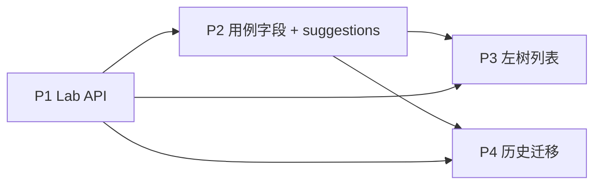

# 测试用例目录（Catalog）开发计划

> 依据：[test-case-catalog.md](./test-case-catalog.md) v1.0  
> 预估总工期：**约 12–16 人日**（1 名全栈；可拆 4 个 PR 并行后端优先）

---

## 0. 目标与交付物

| 交付物 | 说明 |
|--------|------|
| 后端 | `test_labs`、`test_catalog_segments` 集合；`/api/v1/catalog/*`；用例字段与列表过滤 |
| 前端 | Lab 管理页；用例创建/编辑「所属目录」；`ManualTestCaseList` 左树 + 面包屑 |
| 数据 | 迁移脚本 + 默认 Lab；RBAC 新权限 |
| 质量 | 单元测试 + 集成测试；更新 `docs/guide` 与 API 说明 |

**不在本期**：段批量重命名/合并、按目录套执行、`test_category` 废弃。

---

## 1. 依赖关系（必须先做）

- **P1** 可独立上线（仅管理 Lab，不影响旧用例创建）。
- **P2** 之后新用例必须带目录；旧数据需 **P4** 或临时允许 `lab_id` 为空（不推荐，定稿要求迁移）。
- **P3** 依赖 P2 列表字段与 `catalog/tree`。

---

## 2. 分期任务清单

### P1 — Lab 管理（后端 + 管理页）【约 3–4 人日】

#### 2.1.1 后端

| 序号 | 任务 | 文件/位置 | 验收 |
|------|------|-----------|------|
| P1-B1 | 新增 `TestLabDoc` 模型与 Beanie 注册 | `repository/models/test_lab.py`、`main.py` lifespan | 启动无报错，索引创建 |
| P1-B2 | `CatalogPathNormalizer` 领域工具（段校验、小写） | `test_specs/domain/catalog_path.py` | 单测：非法 `/`、空串、大小写 |
| P1-B3 | `LabService`：CRUD、列表、按 code 查重 | `service/lab_service.py` | 单测覆盖 |
| P1-B4 | `POST .../deactivate`：迁移用例 `lab_id`、更新 segment 计数、置 `is_active=false` | 同上 + 事务 | 集成：停用后旧 Lab 无用例 |
| P1-B5 | `DELETE`：仅 0 用例可删 | 同上 | 有用例时 409 |
| P1-B6 | API 路由 `/api/v1/catalog/labs` | `api/catalog_routes.py`、挂 `shared/api/main.py` | OpenAPI 可见 |
| P1-B7 | RBAC：`catalog:labs:read`、`catalog:labs:manage` | `scripts/init/init_rbac.py`；admin + TPM 角色 | 无权限 403 |
| P1-B8 | 种子数据：可选 `init_catalog.py` 预置 BIOS/BMC 等 | `scripts/` | 新环境可一键初始化 |

#### 2.1.2 前端

| 序号 | 任务 | 文件/位置 | 验收 |
|------|------|-----------|------|
| P1-F1 | `api.ts`：lab 列表/创建/更新/停用/删除 | `services/api.ts` | 类型完整 |
| P1-F2 | `CatalogLabsPage`：表格 + 表单 + 停用迁移弹窗 | `components/CatalogLabsPage.tsx` | TPM 可管；普通用户不可见入口 |
| P1-F3 | 导航：`App.tsx` / `AppShell` 增加入口（权限门控） | `types/app.ts` PageType | 与 RBAC 一致 |

#### 2.1.3 测试

- `tests/unit/test_specs/test_lab_service.py`
- `tests/integration/test_specs/test_catalog_labs_api.py`

**P1 完成标准**：管理员可维护 Lab；停用 Lab 时用例全部出现在目标 Lab 下（路径不变）。

---

### P2 — 用例目录字段 + Creatable（后端 + 表单）【约 4–5 人日】

#### 2.2.1 后端

| 序号 | 任务 | 文件/位置 | 验收 |
|------|------|-----------|------|
| P2-B1 | `TestCaseDoc` 增加 `lab_id`、`catalog_path`、`catalog_path_key`；`ref_req_id` 改 Optional | `test_case.py` | 模型迁移说明写在脚本 |
| P2-B2 | 索引：`lab_id`、`catalog_path_key` 前缀查询 | Settings.indexes | explain 可查 |
| P2-B3 | `TestCatalogSegmentDoc` + 懒登记/计数 | `test_catalog_segment.py` | 创建用例后 segment 存在 |
| P2-B4 | `CatalogService`：`register_path`、`suggestions`、`build_breadcrumb` | `service/catalog_service.py` | 单测 |
| P2-B5 | 扩展 `TestCaseService.create/update`：校验 active Lab、规范化 path、写 segment | `test_case_service.py` | 集成创建成功 |
| P2-B6 | Schema：`CreateTestCaseRequest` 必填 `lab_id`+`catalog_path`；`ref_req_id` 可选 | `schemas/test_case.py` | 与文档一致 |
| P2-B7 | `GET /catalog/suggestions?lab_id&parent_path=` | `catalog_routes.py` | 返回下一层段名 |
| P2-B8 | 列表 `GET /test-cases`：`lab_id`、`catalog_prefix` | `test_case_routes.py`、`test_case_service.list` | 前缀过滤正确 |
| P2-B9 | 响应投影 `catalog_breadcrumb` | query/response mapper | 含 Lab 显示名 |

**注意**：`test_case_service.create` 当前强依赖 `ref_req_id` 与 requirement 校验，需分支：**无 ref_req_id 时跳过 requirement 校验**（workflow 创建策略需产品确认：无需求是否仍建 workflow 事项 — 建议 **仍创建** TEST_CASE 工作流，与现网一致）。

#### 2.2.2 前端

| 序号 | 任务 | 文件/位置 | 验收 |
|------|------|-----------|------|
| P2-F1 | 组件 `CatalogPathEditor`：Lab 下拉 + 动态段 + Creatable | `components/catalog/CatalogPathEditor.tsx` | ≥1 段；可增删级 |
| P2-F2 | 接入 `CreateTestCaseForm` / 编辑模式 | 替换/补充原 ref 锁定逻辑 | 新建必填目录 |
| P2-F3 | `ref_req_id` 标可选；`RequirementsPage` 创建用例仍预填 req | 行为不回归 |
| P2-F4 | 类型 `TestCaseResponse` 增加 catalog 字段 | `types/index.ts` | tsc 通过 |

#### 2.2.3 测试

- 更新 `test_test_case_create_initial_state.py`、workflow 集成用例（补 `lab_id`+`catalog_path`）
- `tests/integration/test_specs/test_case_catalog_fields.py`

**P2 完成标准**：新建/编辑用例必须选 Lab + 至少一段路径；suggestions 可联想；列表可按 `lab_id` 过滤。

---

### P3 — 用例管理左树 + 主视图【约 3–4 人日】

#### 2.3.1 后端

| 序号 | 任务 | 文件/位置 | 验收 |
|------|------|-----------|------|
| P3-B1 | `GET /catalog/tree?lab_id=` 聚合 segments + case 数 | `catalog_service.build_tree` | 深度可变 |
| P3-B2 | 列表性能：limit + 子树 prefix（`catalog_path_key` 正则 `^a/b/`） | service 层封装 | 1000 条内 <500ms 量级 |

#### 2.3.2 前端

| 序号 | 任务 | 文件/位置 | 验收 |
|------|------|-----------|------|
| P3-F1 | `CatalogTreeSidebar`：Lab 切换 + 异步展开 | `components/catalog/CatalogTreeSidebar.tsx` | 点击节点筛选右侧 |
| P3-F2 | 重构 `ManualTestCaseList`：左树 + 右表 + 顶栏面包屑 | 主布局 | 为主入口 |
| P3-F3 | 新建按钮继承当前 `lab_id` + `catalog_prefix` | 打开 Create 表单预填 | |
| P3-F4 | `TestCaseDetailModal` / 列表行展示 `catalog_breadcrumb` | | 完整路径可见 |
| P3-F5 | `RequirementsPage` 用例表增加面包屑列（只读） | 非主入口但一致 |

#### 2.3.3 测试

- 前端 `tsc`；手工测试树展开与筛选
- 集成：`test_catalog_tree_api.py`

**P3 完成标准**：测试人员以目录树浏览用例为主；详情见面包屑。

---

### P4 — 迁移与收尾【约 2–3 人日】

| 序号 | 任务 | 文件/位置 | 验收 |
|------|------|-----------|------|
| P4-1 | `migrate_test_case_catalog.py`：默认 Lab + `["未分类"]` | `backend/scripts/` | 干跑 + 实跑 idempotent |
| P4-2 | 从现有用例 backfill `catalog_path_key` | 同上 | 全量有 key |
| P4-3 | 更新 `docs/guide/test-requirements-cases.md` API 表 | docs | 与实现一致 |
| P4-4 | 更新 `backend/docs/reference/database-tables.md` | | |
| P4-5 | 回归：`pytest` 全量 + 前端 lint | CI | 绿 |

**P4 完成标准**：生产/测试库无缺失 `lab_id`；旧客户端若只传 `ref_req_id` 会 422（文档说明）。

---

## 3. PR 拆分建议

| PR | 范围 | 可评审重点 |
|----|------|------------|
| PR-1 | P1 后端 + RBAC + 测试 | 停用迁移事务、权限 |
| PR-2 | P1 前端 Lab 管理页 | UX、停用弹窗 |
| PR-3 | P2 后端模型 + catalog API + test-case 扩展 | 破坏性变更、索引 |
| PR-4 | P2 前端 CatalogPathEditor + 表单 | 交互 |
| PR-5 | P3 树 + ManualTestCaseList | 性能、状态 |
| PR-6 | P4 迁移脚本 + 文档 | 运维 |

PR-1/PR-3 可后端先行合并；前端 PR-2 可与 PR-3 并行（mock Lab API 期间）。

---

## 4. 关键技术决策（实现时落地）

1. **`catalog_path_key`**：`"/".join(catalog_path)`，查询前缀 `^${prefix}(/|$)` 或字符串 `startswith(prefix + '/')`。
2. **Workflow**：无 `ref_req_id` 时仍 `create_item(TEST_CASE)`（与现逻辑一致，避免无状态用例）。
3. **展示**：面包屑段名显示 **库内小写** 或首屏用户输入缓存（一期用小写即可，与 #11 一致）。
4. **segment 计数**：创建 +1、删除 -1、迁移 Lab 时按用例批量调整目标 Lab 的 segment。

---

## 5. 风险与缓冲

| 风险 | 计划缓冲 |
|------|----------|
| `ref_req_id` 必填改为可选牵动大量测试 | P2 专门 0.5 人日改 fakes/fixtures |
| 深路径树 API 慢 | P3 加 `catalog_path_key` 索引 + 树节点仅返回有直接子节点的分支 |
| 前端 Creatable 状态复杂 | 抽 `CatalogPathEditor` 单测（RTL 可选） |

---

## 6. 里程碑时间表（示例）

| 周 | 里程碑 |
|----|--------|
| W1 | P1 完成，Lab 管理可上线 |
| W2 | P2 完成，新用例必须带目录 |
| W3 | P3 完成，左树主视图 |
| W3–W4 | P4 迁移 + 全量回归 |

---

## 7. 验收检查表（上线前）

- [ ] 管理员/TPM 可 CRUD Lab；`code` 创建后不可改
- [ ] 停用 Lab 必须选目标 Lab，用例 `lab_id` 全部迁移
- [ ] 无下属用例才可删除 Lab
- [ ] 创建用例：Lab + ≥1 路径段必填；段禁止 `/`；入库小写
- [ ] suggestions / tree API 正常
- [ ] 用例列表按 Lab + 前缀过滤
- [ ] 历史数据迁移至 `DEFAULT` / `未分类`
- [ ] `ref_req_id` 可选，关联需求流程仍可用
- [ ] 文档与 RBAC 已更新

---

## 8. 变更记录

| 日期 | 说明 |
|------|------|
| 2026-06-04 | v1.0 初版开发计划 |
