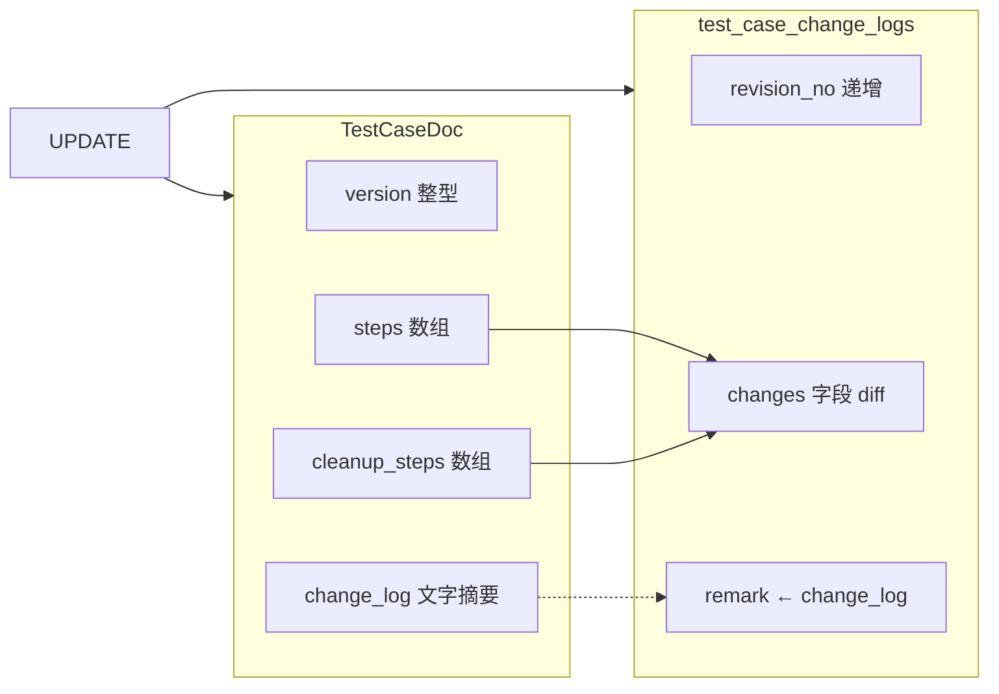
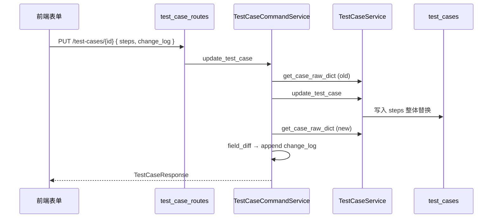
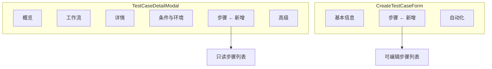
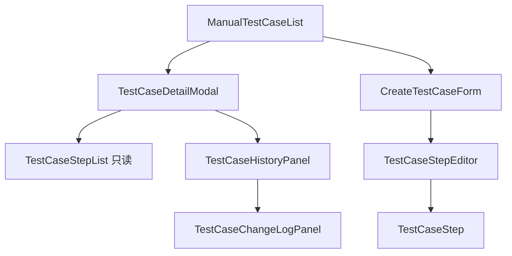

# 测试用例步骤与期望结果设计

> 版本：v1.0 · 2026-06-05  
> 状态：设计定稿（待实现）  
> 关联模块：`test_specs`、前端 `TestCaseDetailModal` / `CreateTestCaseForm`  
> 关联文档：[测试需求与用例指南](../guide/test-requirements-cases.md)、[变更记录](../../backend/docs/modules/test-specs/change-log.md)、[目录设计](./test-case-catalog.md)

---

## 1. 背景与目标

### 1.1 为什么需要步骤

DML V4 面向 **DDR5 / 服务器硬件验证** 平台。手工测试用例的核心价值不仅是「测什么」（标题、目录、需求关联），更是 **「怎么测、怎样算通过」**：

- **可执行性**：测试工程师在 Lab 按步骤操作（上电、进 BIOS、跑 stress、读传感器），步骤是现场 SOP。
- **可评审性**：审核人需对照「动作 + 期望」判断用例是否覆盖需求、期望是否可观测、是否遗漏 cleanup。
- **可自动化映射**：后续自动化脚本与手工步骤对齐，`action` / `expected` 是脚本断言与报告的结构化输入。
- **可追溯性**：步骤变更必须进入变更记录，与现有 `version` + `change_log`（版本说明）形成完整审计链。

### 1.2 现状与差距

| 层级 | 现状 |
|------|------|
| 指南文档 | 已描述 `steps` / `cleanup_steps` 字段及示例 JSON |
| API Schema | 已定义 `TestCaseStepSchema`（`step_id`, `name`, `action`, `expected`），但 **未** 接入 Create/Update/Response |
| MongoDB 模型 | `TestCaseDoc` **缺少** `steps` / `cleanup_steps` 字段 |
| 变更记录 | `TRACKED_FIELDS` **未** 包含步骤字段 |
| 前端类型 | `TestCaseStep` 接口已存在，**未** 挂到 `CreateTestCaseRequest` / `TestCaseResponse` |
| 详情页 | `TestCaseDetailModal` 五个 Tab，**无** 步骤展示 |
| 创建/编辑表单 | `CreateTestCaseForm` 两个 Tab，**无** 步骤编辑 |

**目标**：补齐端到端链路（存储 → API → 变更记录 → 详情只读 → 表单编辑），一期聚焦 **执行步骤 + 期望结果**；清理步骤与扩展字段分阶段交付。

### 1.3 非目标（本期不做）

- 步骤级执行结果回填（属于 execution 模块）
- AI 自动生成步骤内容（仅预留 Hook，见 §4.5）
- 步骤附件上传（P2）
- 独立步骤版本历史表（复用现有 `test_case_change_logs`）

---

## 2. 数据模型设计

### 2.1 步骤结构（对齐现有 Schema）

沿用 `TestCaseStepSchema` 与指南文档约定，**不引入** 与现有命名冲突的新字段名：

| 字段 | 类型 | 必填 | 说明 |
|------|------|------|------|
| `step_id` | string | 是 | 步骤稳定标识（客户端生成 UUID 或 `S{n}`，用于 diff 与自动化映射） |
| `name` | string | 是 | 步骤短标题（如「安装内存」「读取 SPD」） |
| `action` | string | 是 | 执行动作 / 操作描述（对应用户口中的 description） |
| `expected` | string | 是 | 期望结果（对应 expected_result） |

**序号 `step_no`**：不单独持久化。列表顺序即执行顺序；UI 与 API 响应中可附加 **派生** 字段 `step_no`（1-based index），便于展示与导出，写入时忽略。

```json
{
  "step_id": "550e8400-e29b-41d4-a716-446655440000",
  "name": "安装内存",
  "action": "在 DIMM0–DIMM3 安装 4 条 DDR5-5600 RDIMM，上电进入 OS",
  "expected": "BIOS 与 OS 均识别 512GB 总容量，无 POST 错误"
}
```

### 2.2 可选扩展字段（分期）

| 字段 | 阶段 | 说明 |
|------|------|------|
| `data_inputs` | P2 | `Record<string, string>`，步骤级参数（如目标 IP、频率） |
| `notes` | P2 | 执行备注 / 注意事项 |
| `attachments` | P2 | 步骤级附件 ID 列表，复用 attachments 模块 |
| `is_optional` | P2 | 可选步骤标记 |

P0 仅实现四核心字段，Schema 使用 `extra="forbid"` 拒绝未知键，便于后续扩展时显式开字段。

### 2.3 cleanup_steps（清理步骤）

指南与示例已包含 `cleanup_steps`，与 `steps` **同结构**（`TestCaseStepSchema[]`）。

| 决策 | 说明 |
|------|------|
| 存储 | `TestCaseDoc.cleanup_steps: List[TestCaseStepSchema]`，默认 `[]` |
| UI | 与执行步骤同 Tab 内 **折叠区块**「清理步骤」，默认收起 |
| 必填 | **否**；破坏性测试（`is_destructive=true`）保存时 **前端提示** 建议填写 cleanup |
| 变更记录 | 独立字段 `cleanup_steps` 参与 diff |

### 2.4 MongoDB 字段（TestCaseDoc）

在 `repository/models/test_case.py` 的 `TestCaseDoc` 新增：

```python
steps: List[Dict[str, Any]] = Field(default_factory=list, description="执行步骤")
cleanup_steps: List[Dict[str, Any]] = Field(default_factory=list, description="清理步骤")
```

建议使用嵌入式 Pydantic 子模型（Beanie 兼容）：

```python
class TestCaseStepEmbedded(BaseModel):
    step_id: str
    name: str
    action: str
    expected: str
```

**索引**：步骤内容不参与查询过滤，**不建** 步骤级 MongoDB 索引。

### 2.5 与 version / change_log 的关系



| 概念 | 行为 |
|------|------|
| `version` | **用户手动维护**的用例版本号（与 today 实现一致）；步骤大改时 UI **建议** 递增并填写 `change_log`，但不强制自动 bump |
| `change_log` | 用户填写的版本说明；写入变更记录条目的 `remark` |
| `test_case_change_logs` | 步骤变更通过 `steps` / `cleanup_steps` 字段 diff 记录；**不** 单独建步骤 revision 表 |

未来若需「步骤-only 小改不升 version」，由流程规范约束，不在 P0 做自动策略。

### 2.6 change_log diff 追踪

在 `domain/field_diff.py` 的 `TRACKED_FIELDS` 中 **新增**：

```python
"steps",
"cleanup_steps",
```

| 场景 | diff 行为 |
|------|-----------|
| 首次创建带步骤 | `CREATE` + `steps` change_type=`added` |
| 修改任一步骤内容 | 整数组比较 → `modified`（与 `tags` 相同策略） |
| 清空步骤 | `removed` |
| 仅 reorder | 数组元素顺序变化 → `modified`（normalize 后 JSON 不等） |
| reorder 是否单独标识 | P0 **否**；P1 可在 `formatChangeValue` 做步骤级友好 diff |

`get_case_raw_dict()` 经 `_doc_to_dict` 自动包含新字段，无需额外改动快照逻辑。

---

## 3. API 设计

### 3.1 原则：嵌入用例 CRUD，不单独开资源

与 [测试需求与用例指南](../guide/test-requirements-cases.md) 一致：`steps` / `cleanup_steps` 作为用例文档内嵌数组，经现有端点读写：

| 方法 | 路径 | 变更 |
|------|------|------|
| POST | `/api/v1/test-cases` | 请求体可含 `steps`, `cleanup_steps` |
| PUT | `/api/v1/test-cases/{case_id}` | 部分更新；显式提交 `steps` 时 **整体替换** 数组 |
| GET | `/api/v1/test-cases/{case_id}` | 响应含 `steps`, `cleanup_steps` |
| GET | `/api/v1/test-cases` | 列表 **默认不含** 步骤（体量）；可选 `include_steps=true`（P2） |

**不采用** `/test-cases/{id}/steps` 子资源：避免双写、事务与变更记录分裂；硬件用例步骤与元数据一体编辑。

### 3.2 Schema 变更

**`schemas/test_case.py`**（已有 `TestCaseStepSchema`，需挂接）：

```python
class CreateTestCaseRequest(BaseModel):
    ...
    steps: List[TestCaseStepSchema] = Field(default_factory=list, ...)
    cleanup_steps: List[TestCaseStepSchema] = Field(default_factory=list, ...)

class UpdateTestCaseRequest(BaseModel):
    ...
    steps: Optional[List[TestCaseStepSchema]] = None
    cleanup_steps: Optional[List[TestCaseStepSchema]] = None

class TestCaseResponse(BaseModel):
    ...
    steps: List[TestCaseStepSchema] = Field(default_factory=list, ...)
    cleanup_steps: List[TestCaseStepSchema] = Field(default_factory=list, ...)
```

**`TestCaseService._UPDATABLE_FIELDS`** 增加 `steps`, `cleanup_steps`。

### 3.3 请求 / 响应示例

创建：

```http
POST /api/v1/test-cases
Content-Type: application/json

{
  "lab_id": "LAB-BIOS",
  "catalog_path": ["ddr5", "capacity"],
  "title": "DDR5 容量识别测试",
  "steps": [
    {
      "step_id": "a1b2c3d4-e5f6-7890-abcd-ef1234567890",
      "name": "安装内存",
      "action": "安装 4 条 DDR5 并开机",
      "expected": "系统可正常识别容量"
    }
  ],
  "cleanup_steps": []
}
```

详情 GET 响应在现有字段末尾增加 `steps`, `cleanup_steps`（结构同上）。

### 3.4 校验规则

| 规则 | P0 | 说明 |
|------|-----|------|
| 单步四字段非空 | 是 | `name`/`action`/`expected` trim 后长度 ≥ 1；`step_id` 非空 |
| `step_id` 唯一 | 是 | 同一用例内 `steps` 与 `cleanup_steps` 各自数组内不重复 |
| 最少 1 步 | **否（API）** | 兼容历史空数据；**前端** 创建时建议 ≥ 1 |
| 最多步数 | 是 | **100** 步/数组（`max_length=100`） |
| 单字段最大长度 | 是 | `name` ≤ 200；`action` / `expected` ≤ 4000 |
| 提交评审 | 前端 | 工作流 `SUBMIT` 前校验 `steps.length >= 1`（P1 工作流门禁） |

### 3.5 数据流



---

## 4. 前端 UX 设计（重点）

### 4.1 信息架构



### 4.2 详情页：新增「步骤」Tab

**位置**：插在「条件与环境」与「高级」之间（执行内容是核心资产，优先级高于故障分析等）。

**Tab 标签**：`步骤`；若 `steps.length > 0`，显示徽标 `(n)`。

**只读布局**：

```
┌─────────────────────────────────────────────────┐
│ 执行步骤 (3)                    [编辑]（有权限时） │
├─────────────────────────────────────────────────┤
│ ① 安装内存                                       │
│    动作：在 DIMM0–3 安装…                        │
│    期望：BIOS 与 OS 识别 512GB…                  │
├─────────────────────────────────────────────────┤
│ ② 读取 SPD                                       │
│    …                                             │
├─────────────────────────────────────────────────┤
│ ▼ 清理步骤 (1)                                   │
│    ① 恢复默认配置 …                               │
└─────────────────────────────────────────────────┘
```

- **编号**：左侧圆形序号 1, 2, 3…
- **name**：步骤标题，加粗
- **action** / **expected**：标签 + 正文，`white-space: pre-wrap`
- **空状态**：「尚未配置执行步骤」+ 引导「点击编辑添加步骤」（`DRAFT` 且可编辑时）
- **概览 Tab 摘要（P1）**：最多展示前 2 步标题 + 「共 n 步」链接跳转步骤 Tab

**编辑入口**：详情页头部已有「编辑」→ 打开 `CreateTestCaseForm`；步骤 Tab **只读**，不在 Tab 内 inline 编辑（与现有「详情 vs 表单」分工一致）。

### 4.3 创建/编辑表单：新增「步骤」Tab

**位置**：「基本信息」与「自动化」之间。

**布局**：复用 `FormSection` 卡片风格（与 `CreateTestCaseForm` 一致）。

| 控件 | 行为 |
|------|------|
| 步骤列表 | 纵向卡片列表，每卡片含 name / action / expected 三个 textarea/input |
| 添加步骤 | 底部「+ 添加步骤」，新步 `step_id = crypto.randomUUID()` |
| 删除 | 卡片右上角删除；至少保留 0 步（创建草稿允许空，保存前提示） |
| 排序 P0 | 卡片左侧 ↑ / ↓ 按钮交换顺序 |
| 排序 P1 | 可选 HTML5 拖拽或轻量 `@dnd-kit`（需评估依赖） |
| 清理步骤 | 折叠 `FormSection`，交互同执行步骤 |
| 版本说明 | 编辑模式下，步骤 Tab 底部显示 `change_log` textarea（仅 `isEditMode`；改步骤时提醒填写） |

**快速创建路径**：从目录树「快速创建」仍只填目录+标题；步骤可后补。步骤 Tab 显示轻提示：「可先创建草稿，稍后在编辑中补充步骤」。

**校验时机**：

- 点击保存：步骤内字段 trim；非法步阻断并聚焦步骤 Tab
- 工作流提交（P1）：若 `steps.length === 0` 阻断并提示

### 4.4 期望结果展示规范

- 标签统一：**动作** / **期望**（不用英文 Expected）
- 长文本：详情页全文展示；列表页不展示步骤（避免表格过宽）
- 对比度：`expected` 区块使用 `--status-success-bg` 浅底或左边框，与 action 视觉区分

### 4.5 AI 草稿占位（P1 Hook）

不在 P0 实现生成逻辑，仅预留扩展点：

| 位置 | Hook |
|------|------|
| `CreateTestCaseForm` 步骤 Tab 标题栏 | 按钮占位 `AI 生成步骤`（`disabled` + tooltip「即将推出」） |
| `services/api.ts` | 注释预留 `generateTestCaseSteps(caseId, context)` |
| 后端 | 预留 `POST /api/v1/test-cases/{id}/steps/draft` 路由 stub（501）或不出路由，仅设计注释 |

输入上下文（未来）：`title`, `ref_req_id`, `pre_condition`, `target_components`, 关联需求摘要。

### 4.6 移动端 / 紧凑布局

- Tab 栏已有 `overflow-x: auto`（`TestCaseDetailModal`），新增 Tab 不破坏布局
- 步骤卡片小屏 **单列**，↑↓ 按钮放大触控区域（min 44px）
- 表单 textarea `rows={3}`，可纵向滚动；modal `max-height: 90vh` 保持不变

---

## 5. 与工作流 / 变更记录集成

### 5.1 触发 change_log 的操作

| action | 步骤相关触发 |
|--------|--------------|
| `CREATE` | 初始 `steps` / `cleanup_steps` 有值则记录 |
| `UPDATE` | 任一步骤数组变化 |
| 其他 | `ASSIGN_OWNERS` 等 **不** 涉及步骤 |

### 5.2 变更记录 UI

**`TestCaseChangeLogPanel`** / `testCaseFieldLabels.ts`：

```typescript
steps: '执行步骤',
cleanup_steps: '清理步骤',
```

**`formatChangeValue` P0**：步骤数组 → 紧凑 JSON 或「共 n 步 → m 步」摘要。

**P1 友好 diff**：解析数组，按 `step_id` 匹配展示：

```
执行步骤
  ~ 步骤「安装内存」：期望结果变更
  + 新增步骤「读取 SPD」
  - 删除步骤「旧步骤名」
```

### 5.3 评审工作流


| 角色 | 能力 |
|------|------|
| 作者 | `DRAFT` / 驳回态可编辑步骤 |
| 审核人 | `PENDING_REVIEW` **只读** 步骤 Tab；结合变更记录查看本次 diff |
| 审核人 | 现有 `TestCaseHistoryPanel` 已含变更记录 + 流转历史 |

**P1 建议**：工作流提交前校验 `steps.length >= 1`，避免无步骤进入评审。

---

## 6. 迁移与兼容

### 6.1 存量用例

| 情况 | 处理 |
|------|------|
| MongoDB 无 `steps` 字段 | Beanie 默认 `[]`；读写字段不存在时视为空数组 |
| 指南示例已有步骤的数据 | 若曾手动写入 JSON，迁移脚本原样保留（一般无） |
| API 兼容 | GET 始终返回 `steps: []` / `cleanup_steps: []` |

**无需** 批量回填步骤内容；变更记录 **不** 对历史用例回填（与 [change-log.md](../../backend/docs/modules/test-specs/change-log.md) 策略一致）。

### 6.2 空状态 UX

| 场景 | 文案 |
|------|------|
| 详情-步骤 Tab | 「尚未配置执行步骤」 |
| 列表 | 不展示步骤列；可选 P2 列「步数」 |
| 编辑-步骤 Tab | 虚线占位 +「添加第一步」主按钮 |
| 提交评审（P1） | 「请至少添加一条执行步骤后再提交」 |

---

## 7. 实施分期（P0 / P1 / P2）

### 7.1 总览


预估：**P0 约 4–6 人日**（1 全栈）。

### 7.2 P0 — 最小可用（必做）

| # | 任务 | 文件 |
|---|------|------|
| P0-B1 | `TestCaseStepEmbedded` + `TestCaseDoc.steps/cleanup_steps` | `repository/models/test_case.py` |
| P0-B2 | Create/Update/Response 挂接 `TestCaseStepSchema` | `schemas/test_case.py` |
| P0-B3 | `_UPDATABLE_FIELDS` + 创建/更新写入 | `service/test_case_service.py` |
| P0-B4 | `TRACKED_FIELDS` 增加 steps/cleanup_steps | `domain/field_diff.py` |
| P0-B5 | 步骤校验（长度、唯一 step_id、max 100） | `domain/test_case_step_validator.py` 或 schema validator |
| P0-B6 | 单元测试：field_diff、validator | `tests/unit/test_specs/` |
| P0-F1 | 类型：`CreateTestCaseRequest` / `TestCaseResponse` 增加 steps | `frontend/src/types/index.ts` |
| P0-F2 | `TestCaseStepEditor` 组件（列表增删改序） | `frontend/src/components/TestCaseStepEditor.tsx` |
| P0-F3 | `CreateTestCaseForm` 新 Tab「步骤」 | `CreateTestCaseForm.tsx` |
| P0-F4 | `TestCaseDetailModal` 新 Tab「步骤」只读 | `TestCaseDetailModal.tsx` |
| P0-F5 | 变更记录字段标签 | `constants/testCaseFieldLabels.ts` |
| P0-D1 | 更新指南示例（与实现对齐） | `docs/guide/test-requirements-cases.md` |
| P0-D2 | 数据库表文档 | `backend/docs/reference/database-tables.md` |

### 7.3 P1 — 体验与流程

| # | 任务 | 说明 |
|---|------|------|
| P1-F1 | 概览 Tab 步骤摘要 | 前 2 步 + 跳转 |
| P1-F2 | `formatChangeValue` 步骤级 diff 展示 | `TestCaseChangeLogPanel.tsx` |
| P1-F3 | 提交评审前 `steps.length >= 1` | `WorkflowActionToolbar` 或用例提交 hook |
| P1-F4 | 破坏性测试未填 cleanup 警告 | 表单保存时 toast |
| P1-F5 | AI 生成按钮占位 + API stub 注释 | 见 §4.5 |
| P1-F6 | 拖拽排序（可选） | 评估是否引入 `@dnd-kit/core` |

### 7.4 P2 — 扩展

| # | 任务 | 说明 |
|---|------|------|
| P2-B1 | `data_inputs` / `notes` / `is_optional` | Schema + UI |
| P2-B2 | 步骤级 attachments | 关联 attachments 模块 |
| P2-F1 | 列表页「步数」列 | `ManualTestCaseList.tsx` |
| P2-F2 | `include_steps` 列表查询参数 | 后端 + 导出场景 |
| P2-F3 | 步骤 Markdown / 导出 PDF | 按需 |

---

## 8. 开放问题（待产品确认）

| # | 问题 | 建议默认 | 备选 |
|---|------|----------|------|
| 1 | 创建时是否 **强制** ≥ 1 步？ | **否**（草稿可空）；提交评审时强制 | 创建 API 即强制 |
| 2 | 步骤 Tab  vs 放在「条件与环境」内 | **独立 Tab** | 合并到条件 Tab 下半区 |
| 3 | `step_id` 生成策略 | 前端 `crypto.randomUUID()` | 后端生成 |
| 4 | 改步骤是否必须填 `change_log` | **软提示**（步骤变更时高亮版本说明） | 硬校验非空 |
| 5 | cleanup_steps P0 是否一起做 | **是**（模型与 UI 一并交付，可空） | 仅 steps，cleanup 延后 |
| 6 | 列表是否展示步数 | P2 再做 | P0 加一列 |
| 7 | Reorder diff 是否区分「仅排序」 | P0 统一 `modified` | 单独 change_type `reordered` |
| 8 | 自动化脚本与 step_id 绑定 | P2 文档约定 | 本期不涉及 |

---

## 附录 A：字段命名对照

| 用户术语 | 代码字段 |
|----------|----------|
| step_no | 数组下标 + 1（派生，不存储） |
| description / 动作 | `action` |
| expected_result | `expected` |
| 步骤标题 | `name` |

## 附录 B：组件依赖关系



---

**文档维护**：实现阶段若 API 或 Tab 顺序有变，请同步更新本文与 `docs/guide/test-requirements-cases.md`。
