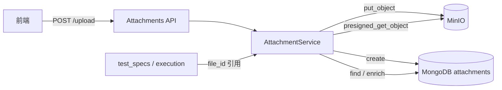

# Attachments 模块

`attachments` 负责**附件元数据管理**，为业务表单（测试用例等）和执行下发提供统一的文件引用能力。文件二进制存 **MinIO**，元数据存 **MongoDB** 集合 `attachments`。

## 文档导航

| 文档 | 内容 |
|------|------|
| [数据模型](./data-models.md) | `AttachmentDoc` 字段、索引、业务侧附件结构 |
| [HTTP API](./api.md) | 路由、请求/响应、错误码 |
| [模块集成](./integration.md) | 与 `test_specs`、`execution` 的协作方式 |

MinIO 客户端封装见 [Shared 层 — MinIO](../shared/index.md)（`app/shared/minio/*`）。  
集合字段速查见 [数据库表与字段](../../reference/database-tables.md#attachments-相关表)。

## 模块职责（一句话）

前端**先上传文件拿到 `file_id`**，业务表单只保存引用；业务写入或任务下发时，后端校验附件有效性并补齐 `storage_path`、`download_url` 等字段。

## 存储架构



**设计原则**：

- 业务模块不直接操作 MinIO，只持有 `file_id` 或已 enrich 的附件快照
- 元数据与对象分离：MongoDB 记录「文件是什么、在哪」；MinIO 存实际字节
- 删除采用**逻辑删除**（`is_deleted`），MinIO 对象默认保留

## 核心目录

```
app/modules/attachments/
├── api/routes.py                 # REST 入口（上传 / 查询 / 下载 / 删除 / 列表）
├── service/attachment_service.py # 上传、enrich、预签名 URL
├── repository/models/attachment.py  # AttachmentDoc
└── schemas/attachment.py         # UploadResponse / AttachmentInfo 等
```

依赖的基础设施：

```
app/shared/minio/
├── config.py      # load_minio_config()
└── client.py      # MinIOClientWrapper（put / get / presigned / remove）
```

## 关键调用链

| 场景 | 调用链 |
|------|--------|
| 上传附件 | API `upload_attachment` → `AttachmentService.upload_file` → MinIO `put_object` → `AttachmentDoc.create` |
| 查询详情 | API `get_attachment` → `get_attachment_info` → Mongo 查询 + 预签名 URL |
| 测试用例绑定附件 | `TestCaseService._create_test_case_with_transaction` → `_validate_and_enrich_attachments` → `AttachmentDoc.find_one` |
| 执行任务 file 参数 | `ExecutionTaskCommandService.create_and_dispatch_task` → `_enrich_case_file_params` → `AttachmentService.enrich_single` |
| 下发 payload 构造 | `build_dispatch_task_data` → `_extract_and_enrich_file_params` → MinIO 预签名 URL → 顶层 `files` 字段 |

上传失败时若 Mongo 写入异常，Service 会尝试**回滚**已上传的 MinIO 对象。

## 关键业务规则

1. **`file_id` 是业务主键**：UUID 字符串，由上传接口生成；业务表单只引用此字段
2. **单文件上限 100MB**：API 层在读取 body 后校验，超限返回 HTTP 413
3. **软删除**：`delete_attachment` 仅标记 `is_deleted=True`，不立即删除 MinIO 对象（物理删除代码已注释，可按策略开启）
4. **引用校验**：业务写入时若 `file_id` 不存在或已删除，抛出 `KeyError` / `ValueError`，事务回滚
5. **预签名 URL 有效期**：默认 7 天（`presigned_url_expires_seconds`，见 `config.yaml` 的 `minio` 段）
6. **SHA256**：上传时计算并持久化，供 execution 下发时在 `files` 字段传递完整性校验

## 与其它模块的关系

| 模块 | 关系 |
|------|------|
| **test_specs** | 测试用例创建时校验 `attachments[].file_id` 并 enrich 元数据（见 [集成说明](./integration.md#test_specs)） |
| **execution** | 任务创建时为 `parameters` 中 `type=file` 的字段注入下载 URL；下发时提取到 payload 顶层 `files`（见 [集成说明](./integration.md#execution)） |
| **shared/minio** | 对象存储客户端；bucket 不存在时自动创建 |
| **auth** | 所有 attachments 路由需 JWT 登录（`get_current_user`），**暂无独立 RBAC 权限码** |

## 配置项

`backend/config.yaml` 中 `minio` 段：

| 字段 | 默认值 | 说明 |
|------|--------|------|
| `endpoint` | `localhost:9000` | MinIO 地址 |
| `access_key` / `secret_key` | `minioadmin` | 访问凭证 |
| `bucket` | `attachments` | 存储桶名（与 `AttachmentDoc.bucket` 一致） |
| `secure` | `false` | 是否 HTTPS |
| `presigned_url_expires_seconds` | `604800` | 预签名链接有效期（秒） |

本地开发需确保 MinIO 可连通；否则上传接口会在 `put_object` 阶段失败。

## 常见修改场景

| 需求 | 优先文件 |
|------|----------|
| 改上传大小限制 | `api/routes.py`（`max_size` 常量） |
| 改对象命名规则 | `service/attachment_service.py` → `upload_file` 中 `object_name` 生成逻辑 |
| 改 enrich 返回字段 | `service/attachment_service.py` → `enrich_for_dispatch` / `enrich_single` |
| 改 API 响应结构 | `schemas/attachment.py` + 对应 route |
| 开启物理删除 | `service/attachment_service.py` → `delete_attachment` 中取消 `remove_object` 注释 |
| 业务侧附件校验规则 | 各业务 service（如 `test_case_service.py` 的 `_validate_and_enrich_attachments`） |

## 风险点

- **元数据与存储不一致**：MongoDB 有记录但 MinIO 对象缺失（或上传中途失败未回滚），会导致下载 / 下发失败
- **引用已删除附件**：业务文档仍持有 `file_id`，但附件已被逻辑删除，写入或 enrich 会失败
- **预签名 URL 过期**：列表接口不返回 `download_url`，需单独调 `GET /{file_id}/download`；execution 下发时会重新生成
- **MinIO 不可用**：上传直接失败；下发阶段 `_extract_and_enrich_file_params` 会打 warning 并跳过 file 提取，可能导致 Agent 拿不到文件
- **无对象级权限**：当前仅 JWT 登录即可上传/删除，未按上传人或业务归属做细粒度授权

## 相关测试

| 文件 | 覆盖 |
|------|------|
| `tests/unit/execution/test_execution_task_attachments.py` | `enrich_for_dispatch`、下发 payload 中 file 参数、MinIO 失败降级 |
