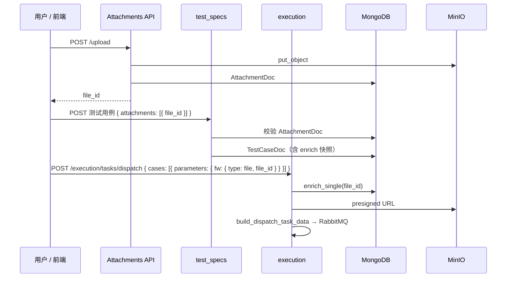

# Attachments 模块集成

attachments 本身不提供业务语义，而是作为**文件引用基础设施**被其它模块消费。典型流程：**先上传 → 业务保存 file_id → 写入/下发时 enrich**。

## 端到端流程



## test_specs

### 测试用例创建

入口：`TestCaseService._create_test_case_with_transaction`  
钩子：`prepare_payload` → `_validate_and_enrich_attachments`

**前端提交**（最小）：

```json
{
  "title": "DDR5 压力测试",
  "attachments": [
    { "file_id": "550e8400-e29b-41d4-a716-446655440000" },
    { "file_id": "...", "description": "测试配置文件" }
  ]
}
```

**后端 enrich 后**写入 `TestCaseDoc.attachments`：

- 校验每个 `file_id` 在 `attachments` 集合中存在且 `is_deleted=false`
- 补齐 `original_filename`、`storage_path`、`size`、`content_type`、`uploaded_at`
- 保留前端额外字段（如 `description`）
- 缺少 `file_id` → `ValueError`
- 附件不存在 → `KeyError`（事务回滚）

实现位置：`app/modules/test_specs/service/test_case_service.py`

### 测试需求

`TestRequirementDoc` 定义了 `attachments` 字段，schema 上与测试用例结构相同，但 **RequirementService 当前未调用** attachments enrich。若需求也要绑定附件，需在 requirement 创建/更新路径增加类似校验。

### 与 workflow 的关系

附件 enrich 发生在 Mongo 事务的 `prepare_payload` 阶段，早于 workflow 事项创建；附件失败会直接阻断用例创建，不会产生半成品 workflow 事项。

## execution

execution 在两个阶段接触 attachments：

### 1. 任务创建 — 参数 enrich

`ExecutionTaskCommandService.create_and_dispatch_task`（及 rerun 路径）对每个 case 的 `parameters` 调用 `_enrich_case_file_params`：

- 识别 `type == "file"` 且含 `file_id` 的 dict 值
- 调用 `AttachmentService.enrich_single`，合并元数据 + **fresh `download_url`**
- 结果写入 `case_payloads`，持久化在 `ExecutionTaskDoc.request_payload` 快照中

**前端 dispatch 请求示例**：

```json
{
  "cases": [{
    "auto_case_id": "AUTO-2026-000001",
    "parameters": {
      "threshold": "0.5",
      "firmware": {
        "type": "file",
        "file_id": "550e8400-e29b-41d4-a716-446655440000"
      }
    }
  }]
}
```

若 `file_id` 无效，任务创建阶段即失败。

### 2. 单 case 下发 — payload 构造

`build_dispatch_task_data`（`task_command_helpers.py`）将已 enrich 的 file 参数转为 Agent 可消费格式：

1. 遍历 `parameters`，找 `type=file` 且含 `object_name` 的项
2. 用 MinIO 生成预签名 URL，填入顶层 `files[param_name] = { url, sha256 }`
3. 对应 parameter 值置为 `""`（空字符串占位）

Agent 收到的 payload 片段：

```json
{
  "action": "create",
  "data": {
    "task_id": "ET-2026-000001",
    "cases": [{
      "case_id": "TC-2026-000001",
      "script_path": "tests/test_demo.py",
      "script_name": "test_demo",
      "parameters": { "threshold": "0.5", "firmware": "" }
    }],
    "files": {
      "firmware": {
        "url": "http://minio:9000/attachments/...",
        "sha256": "abc..."
      }
    }
  }
}
```

**注意**：此步骤依赖 parameters 中已有 `object_name`（来自 enrich_single），而非再次查 Mongo。

### 3. enrich_for_dispatch（批量）

`AttachmentService.enrich_for_dispatch` 提供批量 `$in` 查询，避免 N+1，返回字段与 `enrich_single` 类似但**不含** `download_url`。当前主要用于单测与潜在的任务级附件场景；任务级 `attachments` 字段在 dispatch 请求中已废弃（见 execution 单测 `test_dispatch_task_data_refreshes_file_param_urls`）。

### MinIO 失败降级

`_extract_and_enrich_file_params` 在 MinIO 客户端初始化或 presign 失败时：

- 记录 warning 日志
- 不中断整个下发流程
- 可能导致 `files` 为空或 URL 缺失 — Agent 侧需有容错或运维需排查 MinIO

单测：`tests/unit/execution/test_execution_task_attachments.py`

## 集成检查清单

新增「需要文件」的业务能力时，建议确认：

- [ ] 前端是否先调 `POST /attachments/upload` 拿 `file_id`
- [ ] 业务写入是否校验 `file_id` 有效性（复用 `AttachmentService` 或直接查 `AttachmentDoc`）
- [ ] 持久化的是 enrich 快照还是裸 `file_id`（推荐 enrich 快照，便于列表展示）
- [ ] 若需 Agent 下载，execution parameters 是否使用 `type: file` 约定
- [ ] 删除附件后，历史业务文档中的引用如何处理（当前无引用计数 / 孤儿文件清理）

## 扩展集成方式

| 方式 | 适用 | 说明 |
|------|------|------|
| 直接查 `AttachmentDoc` | 简单校验 | test_specs 当前做法 |
| 调用 `AttachmentService.enrich_single` | 需要 download_url | execution 参数 enrich |
| 调用 `AttachmentService.enrich_for_dispatch` | 批量 file_id | 避免 N+1 |
| 直接调 MinIO client | **不推荐** | 绕过元数据一致性 |

新业务模块应优先通过 `AttachmentService` 集成，避免散落 MinIO 调用。
