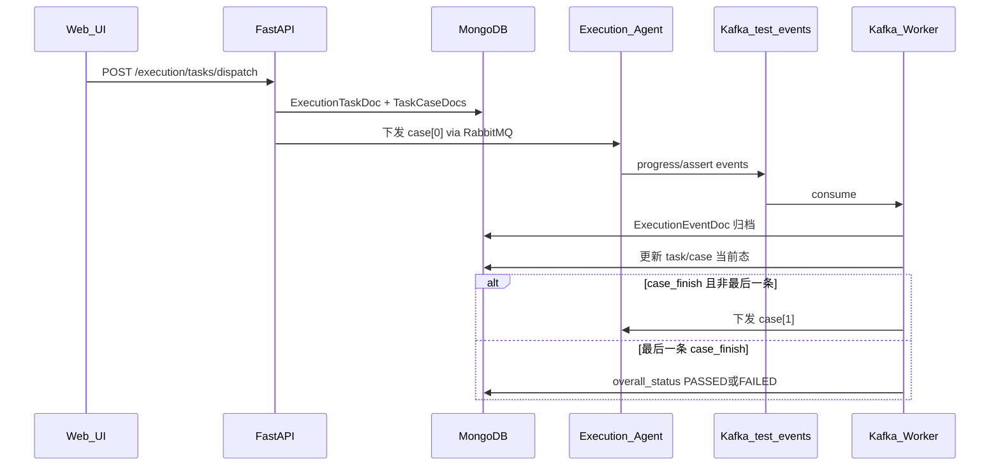

# Execution 架构与进程

## 进程架构

| 进程 | 入口 | 职责 |
|------|------|------|
| **FastAPI 主服务** | `python -m app.main` | HTTP API、创建任务、立即/定时下发入口 |
| **Kafka Worker** | `python -m app.workers.kafka_worker_main` | 消费 `test-events` / 结果 topic，驱动状态聚合与自动推进 |
| **RabbitMQ Worker** | `python -m app.workers.rabbitmq_worker_main` | （若启用）消费 RabbitMQ 测试事件，委托 Kafka Handler |
| **执行代理（外部）** | 自研 Agent | 接收任务、执行 pytest case、向 Kafka 上报事件 |

推荐启动顺序：MongoDB → 初始化 workflow/execution 配置 → Kafka Producer → Kafka Worker → 主服务 → Agent。

## 串行编排模型

与「一次下发全部 case」不同，当前平台采用**严格串行**：

1. 任务创建时写入全部 `ExecutionTaskCaseDoc`，但**只下发 `current_case_index=0` 的 case**。
2. 执行端对该 case 上报 `progress` / `assert` 等事件。
3. 收到 `progress` + `phase=case_finish` 且 case 进入终态（PASSED/FAILED/SKIPPED）后，`ExecutionProgressCoordinator` 判断：
   - 若还有下一条 → 构建下一条 dispatch command 并下发；
   - 若是最后一条 → 收口 `overall_status`，任务结束。
4. `current_case_id` / `current_case_index` 是推进游标；乱序事件（非当前 case）**不会触发自动推进**。



## 分层设计

遵循项目统一分层：**API → Application → Service → Repository**。

- **API**（`api/routes.py`）：参数校验、权限、HTTP 状态码；不写 MongoDB 细节。
- **Application**：用例编排（创建任务、事件 ingest、自动推进）；可组合多个 service。
- **Service**（`service/task_dispatcher.py`）：RabbitMQ 基础设施适配。
- **Repository**：Beanie `Document` 模型与查询。

## 下发通道

任务固定通过 **RabbitMQ** 下发；`dispatch_channel` 字段在 API 与数据库中保留为 `RABBITMQ`（请求体传入其它值会被忽略）。

| 行为 | 说明 |
|------|------|
| **同步下发** | `ExecutionTaskDispatcher` 发送到任务队列；成功/失败立即反映到 `dispatch_status` |
| **payload** | 由 `build_dispatch_task_data()` 统一构造 |

## 配置项（摘录）

见 `backend/config.yaml` 中 `execution:` 段：

- `scheduler_interval_sec`：定时任务扫描间隔
- `default_repo_url`：默认代码仓库地址
- `kafka_worker_*`：Kafka Worker 心跳相关

RabbitMQ 连接与队列见 `rabbitmq:` 段。日志相关见 `logging.module_levels.app.modules.execution` 与 [日志与排障](./logging.md)。

## 去重与快照

execution 模块用三套互补机制避免重复任务、并在用例元数据变更后仍能**按创建时的语义**继续串行编排：

| 机制 | 存储位置 | 主要目的 |
|------|----------|----------|
| **dedup_key** | `ExecutionTaskDoc.dedup_key` | 阻止「相同业务载荷」的**未完成任务**被重复创建 |
| **request_payload** | `ExecutionTaskDoc.request_payload` | 任务级**可重放快照**，供 rerun、定时下发、自动推进下一条 case 时重建命令 |
| **case_snapshot** | `ExecutionTaskCaseDoc.case_snapshot` | case 级**展示/排障快照**，固化创建时测试用例文档的关键字段 |

三者职责不同：`dedup_key` 只管创建前校验；`request_payload` 是编排引擎的数据源；`case_snapshot` 面向列表展示和历史对照，**不参与**下发 payload 的直接拼装（下发仍从 `request_payload` 恢复 `script_path` / `parameters`）。

---

### 1. 任务去重（dedup_key）

#### 何时计算与校验

创建任务时（`ExecutionDispatchService.create_task_from_command`）：

1. 解析 case、规范化 schedule / dispatch_channel
2. 调用 `build_dedup_key(command)` 生成去重键
3. 调用 `ensure_no_active_duplicate(dedup_key)` — 若存在冲突则 **400**，不创建新任务

重跑（rerun）会生成**新 `task_id`**，同样走创建流程，因此也会重新计算 dedup_key 并校验。

#### 去重键如何生成

实现：`task_command_helpers.build_dedup_key`

将下列字段规范化后 JSON 序列化（`sort_keys=True`），再取 **SHA-256 十六进制**：

| 参与哈希的字段 | 说明 |
|----------------|------|
| `dispatch_channel` | 固定为 RABBITMQ |
| `agent_id` | 执行端标识 |
| `trigger_source`、`schedule_type`、`planned_at` | 调度语义 |
| `category`、`project_tag`、`repo_url`、`branch` | 任务元数据 |
| `pytest_options`、`timeout` | 执行参数 |
| `cases[]` | 每条含 `case_id`、`script_path`、`script_name`、`parameters`（按 case 排序后参与哈希） |

**不参与** dedup_key 的字段：

- `task_id`、`created_by`、`source_task_id`（同一载荷不同人/不同任务 ID 仍视为重复）
- `auto_case_id`、`script_entity_id`、`config`（已体现在解析后的 `case_id` / `script_path` / `parameters` 中）
- 附件列表 `attachments`（当前未纳入哈希）

cases 数组按 `(case_id, script_path, script_name, parameters JSON)` 排序，保证顺序无关、内容相同则键相同。

#### 什么叫「重复任务」

`ensure_no_active_duplicate` 查询条件：

```text
dedup_key 相同
AND is_deleted = false
AND overall_status NOT IN {PASSED, FAILED, SKIPPED, CANCELLED}
```

即：只要还有一条**未进入终态**的任务占着相同 dedup_key，就不允许再创建。

任务进入终态（成功、失败、跳过、取消）后，**相同载荷可以再次 dispatch**，会生成新的 `task_id`。

冲突时 API 返回类似：

```text
Task already exists and is not finished: existing_task_id=ET-2026-000042
```

#### 数据库索引

`execution_tasks` 上对 `dedup_key` 及 `(dedup_key, consume_status)` 建有索引，便于创建前快速查重。

---

### 2. 任务级快照（request_payload）

#### 写入时机

任务文档首次插入时，由 `build_task_request_payload(command)` 写入 `ExecutionTaskDoc.request_payload`，与 `dedup_key` 同一次创建流程完成。

#### 保存什么

任务级配置 + **完整 case 列表**（顺序即串行执行顺序），结构示意：

```json
{
  "task_id": "ET-2026-000001",
  "dispatch_channel": "RABBITMQ",
  "agent_id": "...",
  "schedule_type": "IMMEDIATE",
  "planned_at": null,
  "category": "bmc",
  "project_tag": "universal",
  "repo_url": "...",
  "branch": "master",
  "pytest_options": {},
  "timeout": 300,
  "cases": [
    {
      "case_id": "TC-001",
      "auto_case_id": "ATC-2026-00001",
      "script_entity_id": "...",
      "config": {},
      "payload_case_id": "TC-001",
      "script_path": "tests/test_foo.py",
      "script_name": "test_foo",
      "parameters": { "target_ip": "10.0.0.1" }
    }
  ],
  "created_by": "user-1"
}
```

这是平台侧**唯一可信的 case 顺序与下发参数来源**；前端 dispatch 请求里的脚本路径不会被信任，后端解析 `auto_case_id` 后写入此处。

#### 用在哪些地方

| 场景 | 用法 |
|------|------|
| **自动推进下一条 case** | `ExecutionTaskCaseCoordinator.resolve_task_case_pairs` 从快照恢复 case 列表，重建 `DispatchExecutionTaskCommand` |
| **定时任务触发** | Scheduler 读 `ExecutionTaskDoc`，同样从快照 build 第 0 条下发命令 |
| **重跑 rerun** | 默认复制源任务 `request_payload.cases`；请求体可显式覆盖 cases / channel / schedule 等 |
| **查询** | `GET /tasks/{id}/status` 返回完整 `request_payload`，便于对照「创建时到底发了什么」 |

快照在任务生命周期内**通常不再修改**；case 元数据在 test_specs 里后续变更，**不会**自动回写已创建任务的 `request_payload`。

---

### 3. Case 级快照（case_snapshot）

#### 写入时机

创建任务时，`replace_task_case_docs` 为每个 case 插入一条 `ExecutionTaskCaseDoc`，并调用 `build_case_snapshot` 写入 `case_snapshot`。

数据来源：当时查到的 `TestCaseDoc`（手工用例文档）+ 解析得到的 `auto_case_id` / `script_entity_id` / `config`。

#### 保存什么

除脚本路径外，还固化**用例文档上的展示与属性字段**，例如：

- `title`、`version`、`priority`、`tags`、`test_category`
- `ref_req_id`、`pre_condition`、`post_condition`
- `required_env`、`custom_fields`、`attachments`
- `config`（该 case 在任务里的 config）

若 `TestCaseDoc` 不存在，会降级为 `_PlaceholderCaseDoc`（仅 `case_id` 等最小字段），并打 warning 日志，**不阻断**任务创建。

#### 与 request_payload 的区别

| | request_payload.cases[] | case_snapshot |
|--|-------------------------|---------------|
| **层级** | 任务文档内嵌 JSON | 每条 case 独立文档 |
| **核心用途** | 重建下发命令、串行推进 | 列表展示、排障对照 |
| **脚本/参数** | 有 `script_path`、`parameters` | 无 parameters（不在 snapshot 里） |
| **用例属性** | 仅编排必需字段 | 完整 TestCaseDoc 快照 |
| **运行时更新** | 一般不更新 | `case_title_snapshot` 等可被 Kafka 事件覆盖 |

列表 API 序列化时（`ExecutionTaskSerializer`），case 的 `title`、`auto_case_id` 等优先从 `case_snapshot` 读取。

#### 运行时补充：case_title_snapshot

Kafka 事件 ingest 时，若事件带 `case_title`，会写入 `ExecutionTaskCaseDoc.case_title_snapshot`，用于展示「执行端上报时的标题」，**不修改** `case_snapshot` 与 `request_payload`。

---

### 4. 三者协作流程（创建任务）

```text
POST /tasks/dispatch
  │
  ├─ 解析 auto_case_id → case_id / script_path / parameters
  │
  ├─ build_dedup_key → ensure_no_active_duplicate
  │     └─ 冲突 → 400，提示 existing_task_id
  │
  ├─ insert ExecutionTaskDoc
  │     ├─ dedup_key
  │     └─ request_payload（任务 + cases 编排快照）
  │
  ├─ replace_task_case_docs
  │     └─ 每条 ExecutionTaskCaseDoc.case_snapshot（用例文档快照）
  │
  └─ dispatch case[0]（若 IMMEDIATE 或 SCHEDULED 已到点）
```

后续 case[1..n] 的下发**不再读前端**，只读 `request_payload` + 当前游标 `current_case_index`。

---

### 5. 排障提示

| 现象 | 建议查看 |
|------|----------|
| 提示 Task already exists and is not finished | 查 `existing_task_id` 的 `overall_status`；终态后可重试，或改 parameters/cases 改变 dedup_key |
| 重跑结果与预期不一致 | 对比源任务 `request_payload` 与 rerun 请求是否覆盖了 cases |
| 列表 title 与用例库不一致 | 正常：列表用 `case_snapshot`（创建时冻结）；用例库可能已更新 |
| 自动推进用了错误脚本 | 查 `request_payload.cases[n].script_path`，不是当前 automation_test_cases 表 |

相关代码：`task_command_helpers.py`（dedup / request_payload）、`task_case_coordinator.py`（case_snapshot）、`task_dispatch_service.py`（创建流程）。

