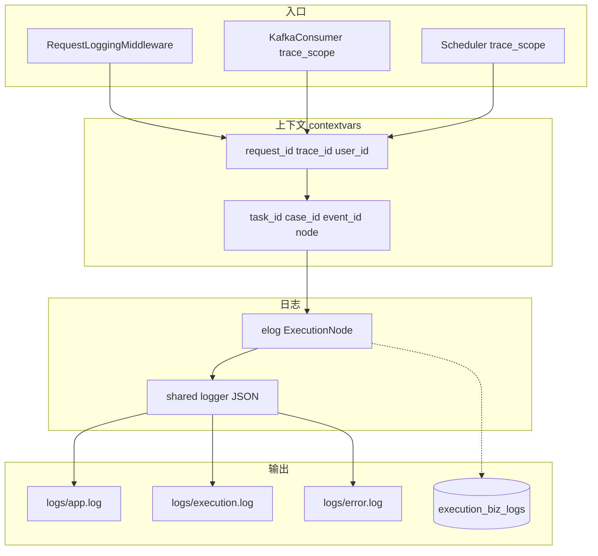

# Execution 日志与排障

execution 模块使用**结构化日志 + 业务上下文 + 可查询业务轨迹**三层能力，目标：按 `task_id` 或 `request_id` 在分钟级定位问题。

## 架构分层



| 层级 | 路径 | 职责 |
|------|------|------|
| 共享 | `app/shared/core/logger.py` | loguru、JSON Lines、脱敏、轮转、`execution.log` 过滤器 |
| 共享 | `app/shared/context.py` | `request_id` / `user_id`（HTTP） |
| 模块 | `app/modules/execution/shared/execution_context.py` | `task_id`、`case_id`、`event_id`、`node` |
| 模块 | `app/modules/execution/shared/execution_log.py` | `ExecutionNode`、`elog()` |

## ExecutionNode 业务节点

| 节点 | 典型场景 |
|------|----------|
| `task.create` | 收到 dispatch 请求、绑定解析完成、任务创建成功 |
| `task.dispatch` | 单 case 下发开始/结束（含 before/after 状态） |
| `task.rerun` / `task.delete` | 重跑、删除 |
| `event.ingest` | Kafka 事件入库、任务聚合更新 |
| `case.update` | case 文档状态变更 |
| `task.advance` | 自动推进下一条（含 skip 原因 DEBUG） |
| `task.complete` | 最后一条 case 完成，任务收口 |
| `scheduler.tick` | 定时任务扫描与触发 |
| `kafka.batch` / `kafka.result` | 批量事件 / 结果 topic |

## 日志级别约定

| 级别 | 使用场景 |
|------|----------|
| **INFO** | 业务节点成功：下发成功、推进下一条、任务完成 |
| **WARNING** | 可恢复：重复 event、case 文档缺失、下发失败 |
| **ERROR** | 需介入：auto-advance 失败、batch 中单条 ingest 异常 |
| **DEBUG** | payload 预览、skip 分支原因（生产可通过 module_levels 关闭） |

## 配置

`backend/config.yaml`：

```yaml
logging:
  module_levels:
    app.modules.execution: "DEBUG"
```

文件输出：

- `logs/app.log` — 全量 JSON
- `logs/execution.log` — 仅 `domain=execution` 的日志
- `logs/error.log` — ERROR 及以上

## 在代码中写日志

```python
from app.modules.execution.shared.execution_context import execution_scope
from app.modules.execution.shared.execution_log import ExecutionNode, elog

async with execution_scope(task_id=task_id, case_id=case_id, node=ExecutionNode.TASK_DISPATCH.value):
    elog(
        "info",
        ExecutionNode.TASK_DISPATCH,
        "dispatch finished",
        outcome="success",
        before={"dispatch_status": old},
        after={"dispatch_status": new},
        channel="RABBITMQ",
        duration_ms=12.5,
    )
```

`elog` 会自动合并：`request_id`、`user_id`、`task_id`、`case_id`、`node`，并对 `payload` 等大字段截断（约 2KB）。

## 链路 ID 规则

| 来源 | request_id 形式 |
|------|-----------------|
| HTTP | 请求头 `X-Request-ID` 或中间件生成 `req_{hex}` |
| Kafka | `kafka:{topic}:{partition}:{offset}` |
| 定时调度 | `scheduler:{iso_timestamp}` |

## 排障 Runbook

### 1. 收集关联键

向用户索取：

- `task_id`（如 `ET-2026-000123`），或
- 接口响应头 `X-Request-ID`

### 2. 查平台业务时间线（推荐首选）

```http
GET /api/v1/execution/tasks/{task_id}/biz-logs
```

或在 MongoDB：

```javascript
db.execution_biz_logs.find({ task_id: "ET-2026-000123" }).sort({ created_at: -1 })
```

### 3. 查 execution 域文件日志

```bash
cd backend
cat logs/execution.log | jq 'select(.task_id=="ET-2026-000123")'
```

按节点过滤：

```bash
cat logs/execution.log | jq 'select(.task_id=="ET-2026-000123" and .node=="task.advance")'
```

### 4. 关联 HTTP 入口

```bash
cat logs/app.log | jq 'select(.request_id=="req_xxxxxxxx")'
```

### 5. 核对外部事件是否入库

```javascript
db.execution_events.find({ task_id: "ET-2026-000123" }).sort({ event_timestamp: -1 })
```

关注 `processed`、`process_error`。

### 6. 看当前态表

```javascript
db.execution_tasks.findOne({ task_id: "ET-2026-000123", is_deleted: false })
db.execution_task_cases.find({ task_id: "ET-2026-000123", is_deleted: false })
```

重点字段：`current_case_id`、`current_case_index`、`overall_status`、`dispatch_error`。

## 常见问题与日志特征

| 现象 | 查什么 | 日志/数据特征 |
|------|--------|----------------|
| 任务创建失败 | `task.create` WARNING/ERROR | 校验错误、auto_case 404 |
| 下发失败 | `task.dispatch` outcome=failed | `dispatch_error`、RabbitMQ 不可用 |
| 事件到了但不更新 | `event.ingest` | task 不存在；或 case 缺失 WARNING |
| 不推进下一条 | `task.advance` DEBUG | outcome=skipped，看 resolved_case_status / current_case_id |
| 重复消费无效果 | `event.ingest` DEBUG | outcome=skipped duplicate |

## 与 ExecutionEventDoc 的区别

| 数据源 | 记录内容 | 用途 |
|--------|----------|------|
| `execution_events` | 执行端上报的**原始** Kafka 事件 | 幂等、审计、回放 |
| `execution_biz_logs` | 平台**决策与状态变更**节点 | 排障时间线、对接前端 |
| `execution.log` | 实时全量结构化日志 | 运维 tail、jq 分析 |

## 相关文档

- [状态与流转](./state-and-flow.md) — 自动推进条件
- [Worker 与消息](./workers.md) — Kafka 消费与 trace
- [排障手册](../../guide/debugging-playbook.md) — 全站排障入口
