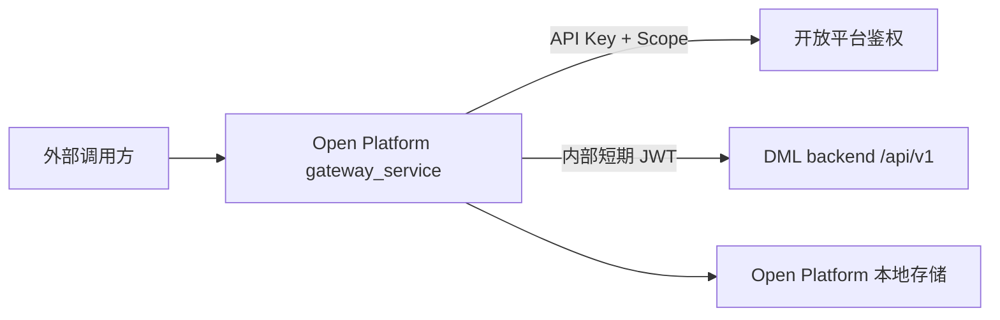
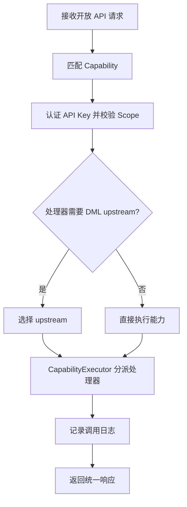

# Open Platform 通讯与能力执行

Open Platform 是 DML 的独立开放能力服务，代码位于仓库根目录 `open-platform/`。它不是 `backend/app/modules` 下的业务模块，也不与 DML 主后端的路由注册表混放。

DML 主后端保持单体 FastAPI 应用形态；Open Platform 作为旁路网关对外暴露稳定的开放 API，并在需要读取或编排 DML 数据时调用 DML 主后端。

## 服务边界



- 外部调用方只访问 Open Platform 的 `/api/v1/open/...`。
- Open Platform 通过 API Key、Scope、配额和密钥状态校验外部请求。
- 调用 DML 主后端时，网关生成短期内部 JWT，DML 后端按普通鉴权依赖解析并加载对应用户。
- 只有 `handler` 需要上游的能力才选择 DML upstream；本地能力直接在 Open Platform 内完成。

## 运行时管线

开放 API 由 `open-platform/backend/gateway_service/api/gateway.py` 接收后交给 `GatewayPipeline`：



关键实现文件：

| 文件 | 职责 |
| --- | --- |
| `core/catalog.py` | 开放能力目录 `CAPABILITIES` |
| `domain/models.py` | `Capability`、API Key、调用日志、Webhook 等数据模型 |
| `core/matching.py` | 按 method/path 匹配能力，并解析路径参数 |
| `core/security.py` | API Key、Scope、配额和密钥状态校验 |
| `core/pipeline.py` | 请求处理管线与审计记录 |
| `core/capability_executor.py` | 按 `handler` 分派能力实现 |
| `core/internal_token.py` | 生成调用 DML 后端的内部 JWT |
| `infrastructure/upstream.py` | 真实 HTTP 转发 |

## 能力契约

每个开放能力都由一个 `Capability` 声明：

| 字段 | 说明 |
| --- | --- |
| `id` | 能力唯一标识 |
| `name` / `category` | 控制台展示信息 |
| `method` / `path` | 对外开放的 HTTP 方法与路径 |
| `scope` | 调用该能力必须具备的 API Key scope |
| `handler` | 执行方式：`proxy`、`local`、`aggregate` |
| `upstreamPath` | `proxy` 能力必须显式声明的 DML 后端路径 |
| `params` | 参数说明，供控制台和调试探针展示 |
| `sampleResponse` | 示例响应 |

契约校验在 `Capability.validate_execution_contract()` 中完成：

- `proxy` 必须定义 `upstreamPath`。
- `local` 和 `aggregate` 不能定义 `upstreamPath`。
- DML 上游路径只能来自能力目录的显式声明，不从开放路径推导。

## Handler 类型

| Handler | 是否需要 DML upstream | 适用场景 | 当前实现 |
| --- | --- | --- | --- |
| `proxy` | 是 | 开放 API 与 DML 内部 API 一一映射 | `ProxyCapabilityHandler` |
| `local` | 否 | 只写 Open Platform 本地数据 | `WebhookRegistrationHandler` |
| `aggregate` | 是 | 聚合多个 DML 响应后输出开放模型 | `ExecutionReportHandler` |

`CapabilityExecutor` 负责选择处理器。代理能力统一走 `ProxyCapabilityHandler`；非代理能力按能力 ID 注册专属处理器。新增非代理能力时，应显式注册处理器，避免在管线里堆条件分支。

## 当前能力目录

| 能力 ID | 对外路径 | Handler | DML upstream |
| --- | --- | --- | --- |
| `cap_task_status` | `GET /api/v1/open/execution/tasks/{task_id}/status` | `proxy` | `/api/v1/execution/tasks/{task_id}/status` |
| `cap_task_timeline` | `GET /api/v1/open/execution/tasks/{task_id}/timeline` | `proxy` | `/api/v1/execution/tasks/{task_id}/timeline` |
| `cap_list_specs` | `GET /api/v1/open/test-specs/cases` | `proxy` | `/api/v1/test-cases` |
| `cap_report` | `GET /api/v1/open/reports/{task_id}` | `aggregate` | 状态接口 + 时间线接口 |
| `cap_webhook` | `POST /api/v1/open/webhooks` | `local` | 无 |

## DML 内部认证

网关调用 DML 主后端时，会生成 `token_use=open_platform_gateway` 的短期 JWT，并放入上游请求：

```text
Authorization: Bearer <internal-jwt>
```

Open Platform 侧环境变量：

| 环境变量 | 说明 |
| --- | --- |
| `DML_GATEWAY_UPSTREAM_AUTH_SECRET` | 内部 JWT 签名密钥 |
| `DML_GATEWAY_UPSTREAM_AUTH_ALGORITHM` | 当前仅支持 `HS256` |
| `DML_GATEWAY_UPSTREAM_AUTH_ISSUER` | JWT issuer |
| `DML_GATEWAY_UPSTREAM_AUTH_AUDIENCE` | JWT audience |
| `DML_GATEWAY_UPSTREAM_AUTH_TTL_SECONDS` | 内部 JWT 有效期，单位秒 |

DML 后端对应配置在 `backend/config/config.yaml`：

```yaml
open_platform_gateway_jwt:
  enabled: false
  secret_key: ""  # 启用时使用 openssl rand -hex 32 生成
  algorithm: "HS256"
  issuer: "dml-open-platform"
  audience: "dml-backend"
  required_token_use: "open_platform_gateway"
```

启用后，两侧的 `secret_key`、`algorithm`、`issuer`、`audience` 必须一致。DML 后端的统一鉴权依赖同时支持普通用户 JWT 与 Open Platform 内部 JWT，并继续加载 `sub` 对应的用户与权限。

## 扩展新能力

1. 在 `open-platform/backend/gateway_service/core/catalog.py` 增加 `Capability`。
2. 如果是 `proxy`，显式填写 `upstreamPath`。
3. 如果是 `local` 或 `aggregate`，在 `CapabilityExecutor` 注册专属处理器。
4. 为处理器补单元测试，至少覆盖成功、鉴权/契约错误、上游异常。
5. 同步更新本页的能力目录表。

验证命令：

```bash
cd open-platform/backend
uv run pytest tests -q
uv run ruff check gateway_service tests
```
