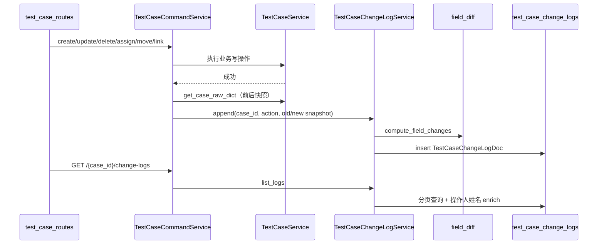

# 测试用例变更记录

本文说明测试用例**字段级变更记录**（UI 称「变更记录」）的后端实现，包括与「流转历史」「版本说明」的区分、写入时机、diff 规则、HTTP API 与 MongoDB 表结构。

## 概念区分

| 概念 | 存储位置 | 说明 |
|------|----------|------|
| **变更记录** | `test_case_change_logs` | 字段级审计：谁在何时改了哪些业务字段 |
| **版本说明** | `TestCaseDoc.change_log` | 用户编辑用例时填写的文字摘要，写入变更记录条目的 `remark` |
| **流转历史** | `bus_flow_logs` | Workflow 状态机流转（提交、审核、驳回等），与业务字段 diff 无关 |

变更记录是**功能上线后向前累积**的审计数据，不对历史用例做回填迁移。

## 架构与调用链



### 核心文件

| 层级 | 路径 | 职责 |
|------|------|------|
| 模型 | `repository/models/test_case_change_log.py` | `TestCaseChangeLogDoc`，集合 `test_case_change_logs` |
| 领域 | `domain/field_diff.py` | `TRACKED_FIELDS`、`compute_field_changes()` |
| 服务 | `service/change_log_service.py` | 写入、分页查询、操作人姓名映射 |
| 应用 | `application/test_case_command_service.py` | 各写操作成功后调用 `_record_change()` |
| API | `api/test_case_routes.py` | `GET /test-cases/{case_id}/change-logs` |
| Schema | `schemas/change_log.py` | 响应模型 |

`TestCaseChangeLogDoc` 已在 `repository/models/__init__.py` 的 `DOCUMENT_MODELS` 中注册，应用启动时由 Beanie 建索引。

## 写入时机

所有写入均发生在 `TestCaseCommandService` 业务操作**成功之后**，通过 `_record_change()` 统一入口：

| `action` | 触发命令 | 说明 |
|----------|----------|------|
| `CREATE` | `create_test_case` | `old_snapshot=None`，记录初始字段 |
| `UPDATE` | `update_test_case` | 对比更新前后快照；`payload.change_log` 写入 `remark` |
| `DELETE` | `delete_test_case` | 软删除，`new_snapshot.is_deleted=True` |
| `ASSIGN_OWNERS` | `assign_owners` | 负责人/审核人/自动化负责人变更 |
| `MOVE_REQUIREMENT` | `move_to_requirement` | `ref_req_id` 变更 |
| `LINK_AUTOMATION` | `link_automation_case` | 通过 `extra_changes` 追加 `auto_case_id` 关联 |

### 跳过写入的条件

`TestCaseChangeLogService.append()` 在以下情况**不插入**文档（`DELETE` 除外）：

- 计算出的 `changes` 为空，且
- 没有 `remark`

即：无字段变化且无版本说明的 UPDATE 不会产生空记录。

## 字段 diff 规则

### 参与 diff 的字段（`TRACKED_FIELDS`）

定义于 `domain/field_diff.py`，包括：

- 基本信息：`title`、`version`、`is_active`、`change_log`、`priority`、`tags` 等
- 归属与目录：`lab_id`、`catalog_path`、`ref_req_id`
- 人员：`owner_id`、`reviewer_id`、`auto_dev_id`
- 测试内容：`pre_condition`、`post_condition`、`attachments`、`custom_fields` 等
- 状态：`is_deleted`

### 不参与 diff 的字段（`IGNORED_DERIVED_FIELDS`）

含派生、工作流与系统字段，例如：

- `catalog_path_key`、`status`、`workflow_item_id`
- `created_at`、`updated_at`
- 列表/详情 enrich 字段：`lab_name`、`catalog_breadcrumb`、`approval_history`

`status` 的变更仍走 workflow 的 `bus_flow_logs`，不在此重复记录。

### `change_type` 语义

| 值 | 含义 |
|----|------|
| `added` | 旧值为空（`None` / `""` / `[]` / `{}`），新值有内容 |
| `removed` | 新值为空，旧值有内容 |
| `modified` | 新旧均有值且不相等 |

比较前会对值做 `_normalize()`（排序 dict 键、列表递归、datetime 转 ISO 字符串等），避免结构等价但序列化不同导致的误报。

### CREATE 行为

`old_snapshot=None` 时，仅对**有初始值**的 tracked 字段生成 `added` 类型变更，跳过空值字段。

## HTTP API

### 获取变更记录

```
GET /api/v1/test-cases/{case_id}/change-logs?limit=20&offset=0
```

- **权限**：`test_cases:read`
- **参数**：
  - `limit`：1–100，默认 20
  - `offset`：默认 0
- **404**：用例不存在（`KeyError` → `test case not found`）

**响应**（包在统一 `APIResponse` 的 `data` 中）：

```json
{
  "items": [
    {
      "id": "665a1b2c3d4e5f6789012345",
      "case_id": "TC-2026-001",
      "revision_no": 3,
      "action": "UPDATE",
      "operator_id": "user-001",
      "operator_name": "zhangsan",
      "changes": [
        {
          "field": "title",
          "old_value": "旧标题",
          "new_value": "新标题",
          "change_type": "modified"
        }
      ],
      "remark": "修正标题表述",
      "created_at": "2026-06-04T10:30:00+00:00"
    }
  ],
  "total": 3
}
```

列表按 `created_at` **降序**；`operator_name` 由 `UserDoc.username` 批量 enrich，查不到时为 `null`。

## 数据库表

集合名：`test_case_change_logs`  
模型：`TestCaseChangeLogDoc`  
详见 [数据库表与字段 — test_case_change_logs](/reference/database-tables#test_case_change_logs)。

### 与 `test_cases` 的关系

- 通过业务键 `case_id` 关联，**无外键约束**
- 每条记录对应用例维度单调递增的 `revision_no`
- 用例软删除后变更记录**保留**，便于审计

### 索引

| 索引 | 类型 | 用途 |
|------|------|------|
| `(case_id, created_at)` | 普通 | 按用例分页、时间排序 |
| `(case_id, revision_no)` | **唯一** | 保证同一用例版本号不重复 |

## 常见修改场景

- **新增可审计字段**：在 `field_diff.TRACKED_FIELDS` 中加入字段名；若该字段在 `get_case_raw_dict()` 返回值中即可自动参与 diff
- **新增写操作类型**：在对应 command 方法成功后调用 `_record_change()`，必要时使用 `extra_changes`（参考 `LINK_AUTOMATION`）
- **调整 UI 字段中文名**：前端 `testCaseFieldLabels.ts`，后端仅存英文字段名
- **扩展 action 枚举**：同步更新 `TestCaseChangeLogDoc.action` 注释、本文档与前端 action 标签

## 测试

单元测试：`tests/unit/test_specs/test_field_diff.py` — 覆盖 `compute_field_changes` 的 added/removed/modified 与 normalize 行为。
