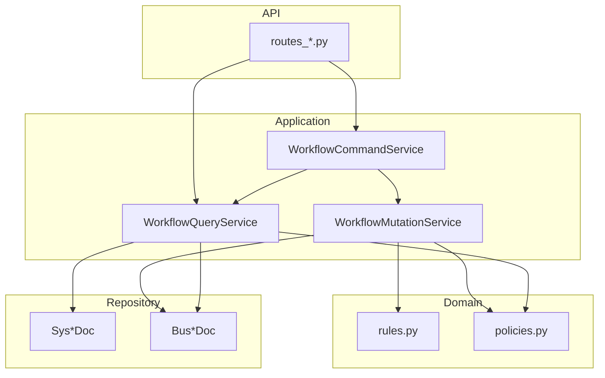
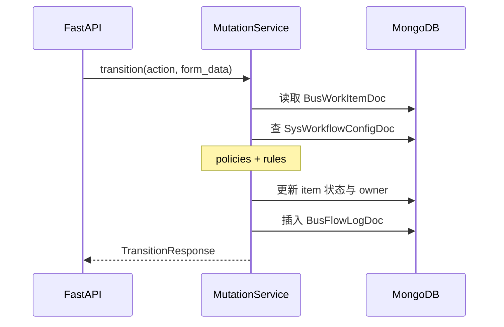
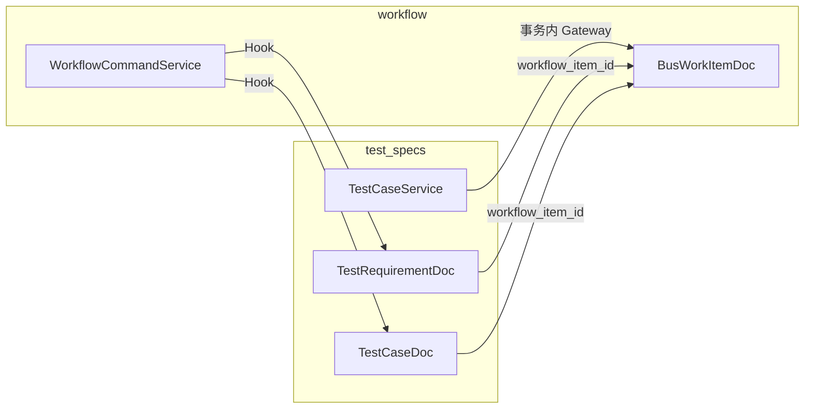

# Workflow 架构与设计

## 设计目标

Workflow 把「谁能在什么状态下执行什么动作、转到哪一状态、负责人是谁」从代码里抽到 **MongoDB 配置表**，使需求/用例等不同业务类型共用同一套引擎，仅 JSON 配置不同。

## 分层结构

遵循仓库统一约定：**API → Application → Domain → Repository**，Domain 不依赖 FastAPI 或 Beanie。



| 层 | 职责 | 不应包含 |
|----|------|----------|
| **API** | 鉴权、Pydantic 校验、HTTP 状态码映射 | 状态机规则、直接 `BusWorkItemDoc` 复杂查询 |
| **Application** | 用例编排、Hook、事务边界 | HTTP 细节 |
| **Domain** | 必填字段、处理人计算、权限判断 | 数据库 I/O |
| **Repository** | Beanie 模型与索引 | 业务流程 |

## 配置驱动状态机

运行时查表键：

```text
(type_code, from_state, action) → SysWorkflowConfigDoc
```

一条配置决定：

- `to_state`：流转后状态
- `target_owner_strategy`：`KEEP` / `TO_CREATOR` / `TO_SPECIFIC_USER`
- `required_fields`：本次 `form_data` 必填键
- `properties`：权限扩展（`allowed_role_ids`、`owner_only` 等）

配置来源：

1. 开发编辑 `backend/app/configs/*.json`
2. 执行 `python app/init_mongodb.py` 写入 MongoDB
3. 进程启动时 `validate_workflow_consistency()` 校验 type/state 引用合法

详见 [配置与初始化](./configuration.md)。

## 状态流转（写路径）

`WorkflowMutationService.handle_transition` 在 **MongoDB 事务** 内完成四步：



1. 按 `work_item_id` 加载事项（排除 `is_deleted`）
2. 查 `(type_code, current_state, action)` 配置；无配置 → `InvalidTransitionError`
3. `can_transition(actor, item, config)` → 失败则 `PermissionDeniedError`
4. `ensure_required_fields` + `resolve_owner` + 更新文档
5. 写入 `BusFlowLogDoc`（`payload` 仅含 `required_fields` 与可选 `remark`）

**不支持事务的部署**（如 standalone Mongo）会在捕获特定错误后抛出 `RuntimeError`，拒绝非原子流转，避免「状态已改但无日志」。

## 创建与删除

### 创建

- 初始状态固定为 **`DRAFT`**（`WorkItemState.DRAFT`）
- `current_owner_id` 初始为 `creator_id`
- 同类型未删除事项 **title 唯一**（DB 部分唯一索引 + 应用层预查）

### 删除（软删除）

- 事务内：写 `action=DELETE` 日志 → `is_deleted=True`
- `WorkflowCommandService.delete_work_item` 在删除前/后调用 **`WorkflowMutationHook`**
- `test_specs` 注入 `TestSpecsWorkflowProjectionHook`：删除需求前检查是否仍有关联用例；删除后软删投影文档

### 改派（Reassign）

- **不改变** `current_state`
- 写 `action=REASSIGN` 日志，`payload` 含 `target_owner_id`、可选 `remark`
- 权限：管理员或当前负责人（`can_reassign`）
- **当前实现未包事务**（单文档更新 + 插日志）

## 读路径与「可用动作」

`get_item_with_transitions`：

1. 加载事项
2. 查询 `type_code` + `current_state` 下所有配置
3. 若传入 `actor`，用 `can_transition` **过滤** 当前用户无权执行的动作

前端据此渲染按钮；真正执行时服务端会再次校验，不可仅信任客户端。

## 列表查询语义

`base_item_query` 默认 `is_deleted=False`。当同时传 `owner_id` 与 `creator_id` 时，二者为 **OR** 关系（「我负责的 **或** 我创建的」），不是 AND。

搜索 `search_items`：

- 优先 MongoDB **全文索引**（`title` + `content`）
- 无 text index 时回退到 **正则** 模糊匹配

## 与 test_specs 的集成



- **创建**：`test_specs` 在 Mongo 事务中同时创建 `BusWorkItemDoc` 与 `TestRequirementDoc` / `TestCaseDoc`
- **列表状态展示**：从 workflow 读 `current_state` 投影到业务列表（非业务表自维护状态）
- **编辑/指派**：`test_specs/domain/policies.py` 中 `can_update_*` **只认工作流**——`current_owner_id` 可改正文（`PENDING_REVIEW` 除外）；`DRAFT` 时 `creator_id` 可改；**ADMIN 不直通编辑**；**不再**因 `tpm_owner_id` / `owner_id` 等业务字段直通编辑
- **删除**：经 `WorkflowCommandService` + Hook 保证投影一起软删；删除权限复用 `can_delete_work_item`（创建人或管理员）
- **序列化增强**：`serialize_work_item` 对 `REQUIREMENT` 类型附加 `req_id`（查 `TestRequirementDoc`）

`test_specs` 的 `WorkflowCommandService` 在 `test_specs/api/dependencies.py` 中注册 Hook；**纯 workflow API** 的默认 `get_workflow_command_service` **不带 Hook**。

## 扩展点

| 机制 | 用途 |
|------|------|
| `WorkflowMutationHook` | 删除前后副作用（test_specs 投影） |
| `WorkflowItemGateway` | test_specs 事务内创建工作项，不直接依赖 MutationService |
| `after_transition` Hook | 预留；当前 test_specs 未注册流转后 Hook |

## 启动与运维

| 检查 | 位置 | 行为 |
|------|------|------|
| 种子数据 | `app/init_mongodb.py` | 合并 JSON、校验重复 transition、同步三表 |
| 运行期 | `validate_workflow_consistency()` | type/state 引用必须存在；三表全空仅 warning |
| Kafka Worker | `kafka_worker_main` | 同样调用 consistency 校验 |

## 相关文档

- [数据模型](./data-models.md)
- [状态与流转](./state-and-flow.md)
- [HTTP API](./api.md)
