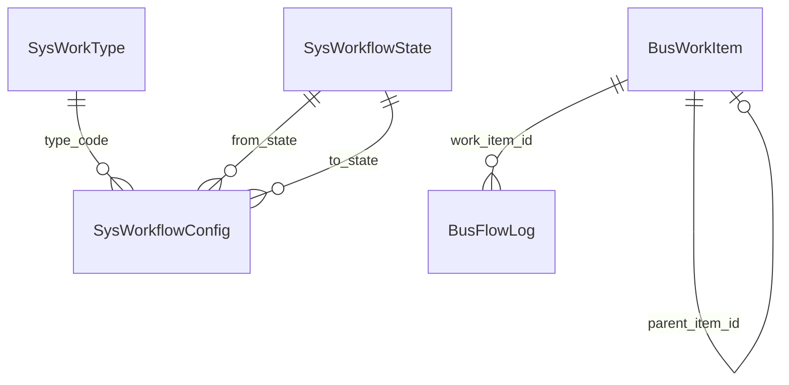

# Workflow 数据模型

所有模型使用 Beanie `Document`，时间字段为 **UTC**。业务查询默认加 `is_deleted: false`。

全局表结构说明亦见 [数据库表与字段](../../reference/database-tables.md#workflow-相关表)。

## 系统配置表（只读为主）

### `sys_work_types` — `SysWorkTypeDoc`

| 字段 | 说明 |
|------|------|
| `code` | 类型编码，唯一，如 `REQUIREMENT`、`TEST_CASE` |
| `name` | 显示名称 |

索引：`code` 唯一。

### `sys_workflow_states` — `SysWorkflowStateDoc`

| 字段 | 说明 |
|------|------|
| `code` | 状态编码，全局唯一，如 `DRAFT`、`PENDING_REVIEW` |
| `name` | 显示名称 |
| `is_end` | 是否终态（影响「是否还能流转出去」的语义展示；由种子脚本推导或 JSON 显式指定） |

索引：`code` 唯一。

状态全集来自 `app/configs/global_config.json` 的 `states` 数组，各业务 JSON 只引用其中 `code`。

### `sys_workflow_configs` — `SysWorkflowConfigDoc`

| 字段 | 说明 |
|------|------|
| `type_code` | 适用事项类型 |
| `from_state` | 源状态 |
| `action` | 动作名，如 `SUBMIT`、`APPROVE` |
| `to_state` | 目标状态 |
| `target_owner_strategy` | `KEEP` / `TO_CREATOR` / `TO_SPECIFIC_USER` |
| `required_fields` | 字符串数组，流转时 `form_data` 必填键 |
| `properties` | 扩展 dict，多用于权限（见 [状态与流转](./state-and-flow.md)） |

索引：

- **唯一**：`(type_code, from_state, action)`
- 普通：`type_code`

同一 `(type_code, from_state)` 可有多条配置（不同 `action`），形成状态机出边。

## 业务表

### `bus_work_items` — `BusWorkItemDoc`

工作流**权威状态源**：`current_state`、`current_owner_id` 以本表为准。

| 字段 | 说明 |
|------|------|
| `type_code` | 事项类型 |
| `title` | 标题；同类型未删除事项唯一 |
| `content` | 描述正文 |
| `parent_item_id` | 父事项 ObjectId；测试用例关联需求 |
| `current_state` | 当前状态码 |
| `current_owner_id` | 当前处理人用户 ID |
| `creator_id` | 创建人用户 ID |
| `is_deleted` | 软删除标记 |

索引（摘录）：

| 索引 | 用途 |
|------|------|
| `type_code`, `current_state`, `current_owner_id`, `creator_id` | 筛选 |
| `(title, content)` text | 全文搜索 |
| `(current_owner_id, created_at)` / `(creator_id, created_at)` | 列表排序 |
| `(parent_item_id, created_at)` | 需求下用例列表 |
| `(type_code, title)` 唯一 + `partialFilterExpression: {is_deleted:false}` | 防重复标题 |

创建时：

- `current_state = DRAFT`
- `current_owner_id = creator_id`

### `bus_flow_logs` — `BusFlowLogDoc`

每次状态变更或改派/删除的审计记录，**只追加**。

| 字段 | 说明 |
|------|------|
| `work_item_id` | 关联事项 ObjectId |
| `from_state` / `to_state` | 变更前后状态（改派/删除时可能相同） |
| `action` | 业务动作或 `DELETE` / `REASSIGN` |
| `operator_id` | 操作人 |
| `payload` | 本次表单快照（必填字段 + 可选 `remark`） |

索引：`(work_item_id, created_at DESC)`，便于按事项拉历史。

## API 序列化约定

`serialize_work_item` 输出字典时：

| 输出字段 | 来源 |
|----------|------|
| `id` / `item_id` | 均为 `str(doc.id)`，兼容历史前端 |
| `parent_item_id` | 转为字符串或 `null` |
| `req_id` | 仅 `type_code=REQUIREMENT` 时，查 `TestRequirementDoc.workflow_item_id` 附加 |

列表接口统一经 `docs_to_dicts` → `serialize_work_item`，保证结构一致。

## 父子关系（需求 ↔ 用例）

- 测试用例事项：`type_code=TEST_CASE`，`parent_item_id` 指向需求事项的 `_id`
- 关系查询 API：
  - `GET /work-items/{id}/test-cases` — 需求下用例列表
  - `GET /work-items/{id}/requirement` — 用例所属需求

`test_specs` 业务表还通过 `ref_req_id` / `workflow_item_id` 维护关联；删除需求时 Hook 检查 `TestCaseDoc.ref_req_id`。

## 与 test_specs 投影字段

| 业务表 | 关联 workflow |
|--------|----------------|
| `test_requirements.workflow_item_id` | 需求事项 ID |
| `test_cases.workflow_item_id` | 用例事项 ID |

列表展示的「流程状态」来自 workflow，而非需求/用例文档内嵌状态字段（具体投影逻辑在 test_specs 服务层）。

## ER 关系（简图）

## 相关文档

- [状态与流转](./state-and-flow.md) — 配置如何驱动行为
- [配置与初始化](./configuration.md) — 如何从 JSON 生成上表数据
