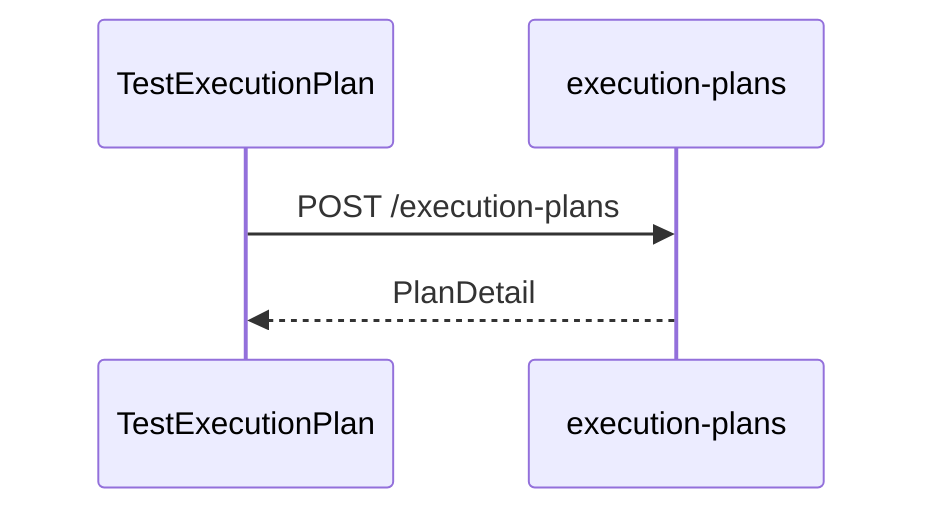
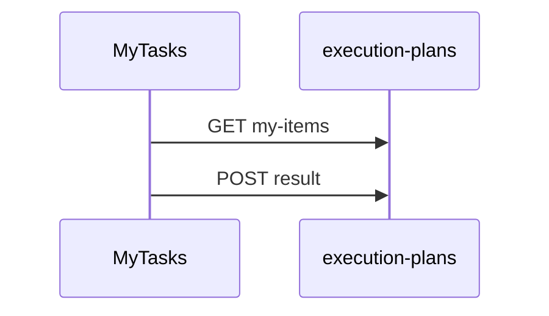
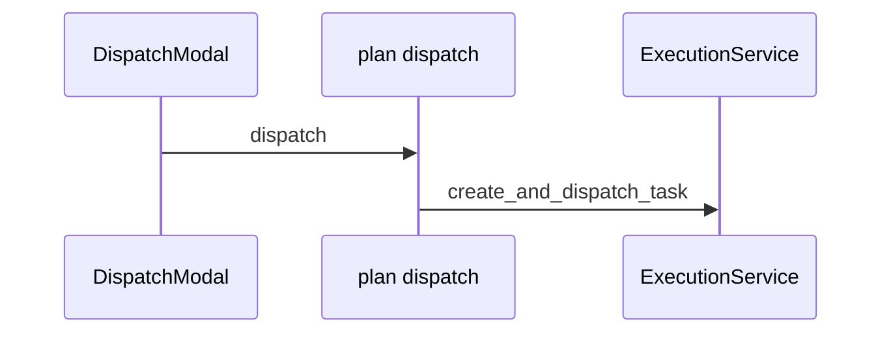

# 手工执行与执行计划后端设计方案

> 版本：v1.0 · 2026-06-08  
> 状态：草案（待评审）  
> 范围：TestExecutionPlan / MyTasks Mock 接入真实 API  
> 关联：execution_plan（新建）、execution、test_specs

---

## 1. 背景与目标

### 1.1 现状

| 层级 | 状态 |
|------|------|
| 产品流程 | TestExecutionPlan → 选 case → 指派 → MyTasks PlanTask → manual 回填 / auto dispatch |
| 前端 | MOCK_PLANS、MOCK_CASES、MOCK_PLAN_TASKS |
| 自动化 | POST /api/v1/execution/tasks/dispatch 已可用 |
| 手工 | 无持久化 |
| WorkItem | 仅 REQUIREMENT / TEST_CASE |

### 1.2 MVP

1. 计划 CRUD + 条目 2. my-items 3. result 回填 4. plan dispatch 5. RBAC

### 1.3 非目标

testPlan.ts 完整模型、WorkItem PLAN_TASK、模板报告

---

## 2. 领域模型

### 2.1 ExecutionPlanDoc (execution_plans)

plan_id, title, description, status(draft/active/done/archived), dates, created_by, item_count, done_count, progress_percent, audit fields

### 2.2 ExecutionPlanItemDoc (execution_plan_items)

item_id, plan_id, ref_type(manual/auto), case_id, manual_case_id, snapshots, assignee_id, status, order_no, execution_task_id, result_summary

Index: (assignee_id, status, updated_at DESC) for my-items

### 2.3 ManualExecutionResultDoc (manual_execution_results)

Align PlanTaskResult: passed, notes, severity, actual, expected, env, test_data, bug_id, duration, attachments, executed_at/by

### 2.4 PlanTask mapping

id=item_id, planId=plan_id, type=ref_type, assignee=assignee_id, result=ManualExecutionResultDoc

---
## 3. API 设计

Base /api/v1/execution-plans, APIResponse[T]

| Method | Path | Permission |
| GET | /execution-plans | execution_plans:read |
| POST | /execution-plans | execution_plans:write |
| GET/PATCH/DELETE | /execution-plans/{plan_id} | read/write |

Items: POST/PATCH/DELETE /{plan_id}/items/{item_id}
My tasks: GET /execution-plans/my-items
Manual: POST/GET /execution-plans/items/{item_id}/result
Auto: POST /items/{item_id}/dispatch, POST /items/batch-dispatch (execution_tasks:write)

Dispatch wraps ExecutionTaskCommandService; stores plan_id/item_id in request_payload

MVP auto status: join execution task on read (QUEUED/RUNNING→running, PASSED→done, FAILED→fail)

---
## 4. 后端模块

backend/app/modules/execution_plan/ (api, schemas, service, repository/models)

Register: bootstrap, main.py, init_rbac (execution_plans:read/write)

---

## 5. 流程图

### 5.1 创建计划

### 5.2 手工回填

### 5.3 Auto dispatch

---

## 6. 前端集成

Modify: types/executionPlan.ts, api.ts, TestExecutionPlan.tsx, myTasksTypes.ts (remove MOCK), MyTasksPage.tsx, ResultBackfillModal, Single/BatchDispatchModal

Replace mocks with API; remove demo assignee fallback

---

## 7. 权限

execution_plans:read/write; dispatch needs execution_tasks:write

MVP: no WorkItem PLAN_TASK extension

---

## 8. Lineage (Phase 2)

Add manual_result node linked from test_case

---

## 9. dispatchTask

Direct board/list: /execution/tasks/dispatch unchanged

Plan auto: must use /execution-plans/items/{id}/dispatch

---

## 10. Phasing

Phase 1: MVP backend+frontend
Phase 2: event sync, lineage, attachments
Phase 3: testPlan.ts, WorkItem, templates

---

## 11. Open questions

component source, auto display ids, re-dispatch, delete rules, approval, result versioning

---

## 12. References

frontend: TestExecutionPlan.tsx, MyTasksPage.tsx, myTasksTypes.ts, ResultBackfillModal.tsx, testPlan.ts
backend: execution/api/routes.py, execution/models/execution.py, workflow/business.py, lineage/lineage_service.py, init_rbac.py, bootstrap.py

---

## 附录 A：关键决策摘要

| 决策 | 选择 | 理由 |
|------|------|------|
| 新模块 | execution_plan | 与 execution 解耦，计划域独立演进 |
| 存储 | 3 个 Mongo 集合 | plan / item / manual_result 清晰边界 |
| WorkItem | MVP 不扩展 PLAN_TASK | 避免 workflow 配置变更 |
| Auto 下发 | 专用 dispatch 端点 | 原子关联 plan_id/item_id |
| 状态同步 | MVP 读时 join | 实现快；Phase 2 事件驱动 |
| case 引用 | manual→case_id, auto→auto_case_id | 对齐 test_specs 现有模型 |

---

## 附录 B：Phase 1 检查清单

Backend: module, models, routes, RBAC, integration tests

Frontend: api.ts, TestExecutionPlan, MyTasksPage, modals, remove all plan mocks
