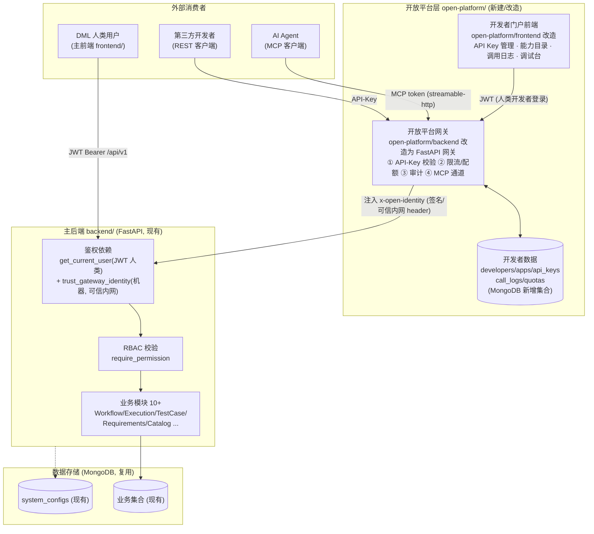

# DML v4 开放平台（Open Platform）可行性评审与架构建议

> 评审人：高见远（架构师 / software-architect）
> 评审性质：**可行性评审 + 架构建议**（本次为评审，非实现，不含代码）
> 依据：团队基于实际代码的现状探查结论（事实 A：主后端 / 事实 B：open-platform/ / 事实 C：主前端）

---

## 1. 可行性结论

### 1.1 总判定

**结论：条件性 YES —— 主后端「结构上可接入」，但「能力上未就绪」。**

- **能否接入（架构扩展性）：YES。** 主后端具备接入开放平台的结构基础：
  1. 业务路由统一聚合到 `api_router` + 前缀 `/api/v1`，`router_registry` 注册机制成熟（已注册 10+ 模块）；
  2. 配置系统（`config.yaml` 顶层分区 + Pydantic `get_settings()`）扩展性强 —— 探查结论明确「新增服务只需加顶层分区 + Settings 模型，无需改路由机制」；
  3. 鉴权已抽象为依赖注入（`get_current_user` + `require_permission` / `require_any_permission`），可低成本增加新的身份解析入口。
- **是否就绪（能力完备性）：NO。** 当前后端是「纯人类用户 + JWT(HS256) + RBAC」系统，**完全没有**机器/第三方凭证、网关、限流、租户、配额、审计。接入开放平台所需的「机器侧」能力全部缺失。

> 一句话：**主后端是一块好地基，但开放平台要盖的「门禁、前台、账房」一栋都没建。**

### 1.2 缺口清单（必须新增的能力）

| # | 缺口能力 | 现状 | 必须补建内容 | 难度 |
|---|---------|------|------------|------|
| G1 | 机器凭证体系 | 仅 JWT(人类) + Execution Agent HMAC-Nonce(非 REST) | API-Key 签发/存储(哈希)/校验/轮换/吊销；可选 OAuth2 client_credentials / service-account | 高 |
| G2 | API 网关 / 代理层 | 无（「gateway」仅指 DDD 内部端口） | 外部请求入口、路由聚合、反向代理内部服务 | 中-高 |
| G3 | 限流 / 配额 | 无 | 按 API-Key / 租户 / IP 的 rate-limit + quota 计量 | 中 |
| G4 | 租户 / 开发者隔离 | 无 tenant / developer 概念 | developer / application / organization 数据模型 + 归属与隔离 | 中-高 |
| G5 | 调用审计 / 计量 | 无（仅前端 mock 的 CallLog 概念） | call_logs 集合 + 全量调用记录 + 用量统计 | 中 |
| G6 | 对外暴露安全加固 | CORS=`['*']` 全开；`trusted_proxies` 空；未启用 `ProxyHeadersMiddleware` | 收紧 CORS、启用 ProxyHeaders、明确信任边界 | 低（但必须） |
| G7 | API-Key ↔ JWT/RBAC 映射 | 无 | 机器身份如何映射到权限/归属（组织 or 个人），与现有 RBAC 并存或对齐 | 高（设计关键） |
| G8 | 对外能力 / 权限目录 | 无 | 对外暴露哪些 endpoint / capability 的注册、授权、scope 定义 | 中 |
| G9 | 对外 API 规范 | 无 OpenAPI/Swagger（仅前端手工 TS 类型） | 若开放 REST，需正式 OpenAPI 文档 | 低-中 |
| G10 | 安全运维 | 无 | API-Key 泄露应急、监控告警、网关可观测性 | 中 |

### 1.3 关键利好（降低实现风险）

- **配置扩展机制成熟** → 新增 `open_platform / developer / api_key` 配置区是 trivial 改动。
- **路由注册机制成熟** → 新增开放平台模块不冲击现有 10+ 业务路由。
- **已有可复用参考实现** → `mcp_server` 的 `backend_token` 模式、Execution Agent 的 HMAC-SHA256 + Nonce 防重放，可直接作为 API-Key / 机器凭证校验的参考。

---

## 2. 网关服务决策

### 2.1 三方案对比

| 维度 | 方案A：主后端内新增 open-platform 模块 | 方案B：独立网关服务（新建/扩展 open-platform/backend） | 方案C：现成网关 Kong/Envoy/APISIX |
|------|--------------------------------------|------------------------------------------------------|----------------------------------|
| 形态 | `backend/` 内新增模块，路由如 `/openapi/v1` 或 `/api/v1/open` | 独立 FastAPI 服务（如端口 8802），API-Key 校验 + 限流，反向代理主后端 | 独立基础设施组件，前置所有流量 |
| 与现有 JWT/RBAC 关系 | 新增 `resolve_api_key` 依赖，把 API-Key 映射为「机器用户」后复用 `require_permission` | 网关校验后注入可信内网 header（如 `x-open-identity`），主后端新增 `trust_gateway_identity` 依赖信任之；细粒度 RBAC 仍由主后端做 | Kong 做粗粒度身份/路由/限流，细粒度 RBAC 仍由主后端做 |
| 对现有代码侵入度 | **中**：改 `main.py`（CORS/中间件）、新增模块 + Settings + 集合 + 中间件 | **低-中**：主后端仅需加「信任网关身份」依赖 + CORS 收紧；网关新写 | **低（代码）/ 高（基础设施）** |
| 安全边界 | 弱：主后端直接暴露公网，需自行兜底限流/防 DoS | 强：边界清晰，主后端不直接暴露 | 最强：生产级安全能力 |
| 扩展性 | 弱：外部流量与业务同进程，难独立扩缩 | 强：网关独立扩缩、独立限流/审计 | 最强 |
| 运维成本 | 低（单部署单元） | 中（多一服务） | 高（新基础设施 + 学习） |
| 与现有 open-platform 子项目关系 | 与 /frontend、/backend 都「另起炉灶」，现有两子项目归位尴尬 | **可整合**：/backend 改造为网关 + MCP 通道，/frontend 做开发者门户 | 与现有两子项目都需重新对接 |
| 适用阶段 | 资源极有限、仅内部/低风险开放的最小可行 | **当前阶段推荐** | 未来规模化、多租户 SaaS |

### 2.2 推荐

**推荐：方案B（独立网关服务）作为当前阶段主路线；方案A 作为最小可行备选；方案C 作为未来演进方向。**

理由：
1. **安全分层**：网关独立使主后端无需直接暴露公网，边界清晰，符合「网关/业务解耦」原则。
2. **复用与归位**：方案B 天然承接现有 `open-platform/` 两个子项目 —— `/frontend` 改造为开发者门户，`/backend`（FastMCP）扩展为「网关 + 开发者 REST 管理 API + MCP 通道（面向 AI Agent）」，避免另起炉灶。
3. **独立扩缩**：限流、配额、审计在网关独立演进，不拖累主后端发布节奏。
4. **对主后端侵入最小**：主后端只需新增一个「信任来自网关的内部身份」的依赖（配合 `trusted_proxies` / 内部签名），并收紧 CORS —— 不改动任何现有业务路由。

**前提条件**：方案B 落地前必须先澄清第 3 点的「定位歧义」。若经澄清开放平台仅限内部、低风险、且无 AI Agent 诉求，可降级用方案A 快速验证。

**方案C 不优先**：当前 DML v4 规模下引入 Kong/Envoy 属 over-engineering；且 Kong 对 MCP/streamable-http 支持有限，与现有 open-platform/backend 的 MCP 通道不好整合。建议作为「多租户 SaaS 化」时的演进选项。

---

## 3. 定位歧义澄清（关键风险）

现状探查暴露了一个**根本性的方向歧义**，必须先行澄清，否则任何架构设计都可能返工：

- `open-platform/frontend` 的 TS 类型（`ApiKey / Capability / CallLog / DebugRequest / OverviewStats / UserPermissions`）明确指向 **「开发者 REST 门户」** —— 面向**人类第三方开发者**，提供 API Key 管理、能力目录、调用日志、调试台。
- `open-platform/backend` 是 **FastMCP 服务**（端口 8810，streamable-http 限定 loopback，用 `backend_token` 调主后端，仅暴露只读工具如 `list_my_test_tasks`）—— 面向 **AI Agent（通过 MCP 协议）**。

**这是两条不同的开放路径：**
- 一条是 **B2D REST API 门户**（人类开发者用 HTTP/REST 调 DML 能力）；
- 一条是 **MCP Agent 通道**（AI Agent 用 MCP 协议调 DML 能力）。

两者在身份模型、协议、门户形态、权限粒度上都不同。

### 需向用户澄清的问题

1. **开放平台面向谁？** 第三方开发者（REST）？AI Agent（MCP）？还是两者都要？
2. 若两者都要，是否需要**统一身份**（同一个 developer 既能申领 API-Key 又能用 MCP），还是各建一套？
3. `open-platform/frontend` 的 100% mock 数据，是计划接真实后端（即真正做开发者门户后端），还是仅做演示/POC？
4. `open-platform/backend` 的 FastMCP 是否就是「开放平台的 Agent 通道」，还是独立内部 AI 工具、不对外？
5. 是否需要对外的 **OpenAPI/Swagger 规范**（前端已有手工 TS 类型，属非正式约定）？
6. **认证模型**：REST 侧 API-Key 与 MCP 侧 token 如何统一或区分？权限(scope)体系是否复用现有 RBAC 角色？
7. 对外暴露的**网络边界**如何定（公网 / 内网 / VPN）？与现有 MCP `loopback` 限制如何协调？

---

## 4. 建议目标架构草图

> 前提假设（待第 3 点澄清后修正）：开放平台**同时**面向 REST 开发者与 MCP Agent，统一开发者身份。

### 4.1 关键设计点说明

- **API-Key 在哪里校验**：在**网关边界（GW）**校验。网关负责 API-Key 的签发（管理 API，走人类 JWT）、校验、限流、配额、审计。主后端不再直接接收外部 API-Key。
- **限流 / 配额在哪里做**：在**网关（GW）**做第一道（按 API-Key / 租户 / IP）。如需生产级可在网关前再加反向代理层（方案C 演进）。
- **与现有 JWT / 人类用户如何并存 / 映射**：
  - 人类用户 → 主前端 → 主后端 `get_current_user`（JWT），**不变**。
  - 机器身份（开发者 / Agent）→ 网关校验 API-Key / MCP-token → 解析出 `developer_id / organization / scopes` → **注入可信内网 header**（建议签名防伪造，参考现有 Execution Agent HMAC-Nonce）→ 主后端新增 `trust_gateway_identity` 依赖，**仅信任来自网关（trusted_proxies）的请求**，将其视为「机器用户」走现有 `require_permission` RBAC。
  - 即：**两种身份来源并存**（JWT 人类 / 网关注入机器），统一在 RBAC 层收敛。
- **开发者 / 租户数据模型放哪**：放**网关侧 + MongoDB 新增集合**（`developers / apps / api_keys / call_logs / quotas`）。主后端**不存** developer 表，仅信任网关注入的身份，保持业务后端纯净。
- **现有 open-platform 两个子项目如何归位**：
  - `open-platform/frontend` → 改造为**开发者门户**（接真实网关，替换 100% mock）。
  - `open-platform/backend` → 从纯 FastMCP 扩展为**网关 + 开发者管理 REST API + 保留 MCP 通道**（一个服务承载对外 REST 与对 Agent MCP，共享同一开发者身份与鉴权）。
- **安全加固**：开放暴露前必须收紧主后端 CORS（移除 `['*']`）、启用 `ProxyHeadersMiddleware`、配置 `trusted_proxies` 仅含网关地址；网关侧启用 HMAC/签名防重放。

---

## 5. 风险与待明确事项清单

### 5.1 主要风险

| 风险 | 说明 | 缓解 |
|------|------|------|
| R1 暴露面安全 | 当前 CORS 全开、无 ProxyHeaders、trusted_proxies 空 | 开放前强制收紧（G6）；网关独立承载外部流量 |
| R2 身份映射失效 | API-Key 未正确映射权限/归属 → RBAC 形同虚设 | 先定 G7 映射模型（组织/个人 + scope）再实现 |
| R3 网关信任伪造 | 注入 header 方案若内网不可信 → 可伪造机器身份 | 网关→主后端用签名 header 或内部 mTLS；trusted_proxies 严格限定 |
| R4 定位歧义返工 | 第 3 点不清 → 门户/网关方向错 | **先澄清再设计**（最高优先级） |
| R5 多租户隔离 | 现有业务集合无 tenant 字段 | 若做多租户 SaaS 需评估业务库改造范围 |
| R6 运维负担 | 多一服务 = 多一份监控/告警/部署 | 网关纳入现有 Docker/监控体系 |

### 5.2 必须向用户/主理人澄清的决策点（待明确事项）

> 以下请主理人拿去问用户，建议在动工前确认：

1. **开放平台面向谁** —— REST 第三方开发者？AI Agent(MCP)？还是两者都要？（决定门户/网关形态）
2. **是否需要开发者门户 UI 接真实后端**，还是 `open-platform/frontend` 保持 mock 演示？
3. **是否多租户 SaaS 模式**（计费/隔离），还是单组织内部开放？
4. **API-Key 权限粒度** —— 与现有 RBAC 角色对齐，还是独立 scope 体系？
5. **限流/配额 SLA 要求** —— 是否需要生产级 Kong，还是自研网关足够？
6. **现有 open-platform/backend（FastMCP）是否纳入开放平台**作为 Agent 通道？
7. **对外暴露网络边界**（公网/内网/VPN）与现有 MCP loopback 限制如何协调？
8. **是否需要正式 OpenAPI 规范**（替代前端手工 TS 类型）？

---

### 附：评审核心结论速览

- **问题1（能否接入）**：条件性 YES。结构可扩展，但 G1–G10 能力需新建。
- **问题2（是否独立网关）**：推荐方案B（独立网关服务），整合现有 open-platform 两子项目；方案A 为最小可行备选；方案C 为未来演进。
- **最大拦路虎**：open-platform 两个子项目的「REST 门户 vs MCP Agent」定位歧义，必须先向用户澄清再设计。
