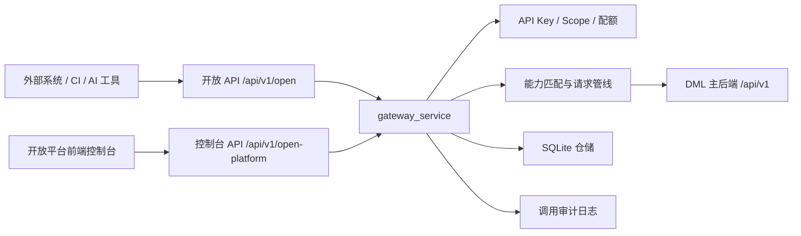
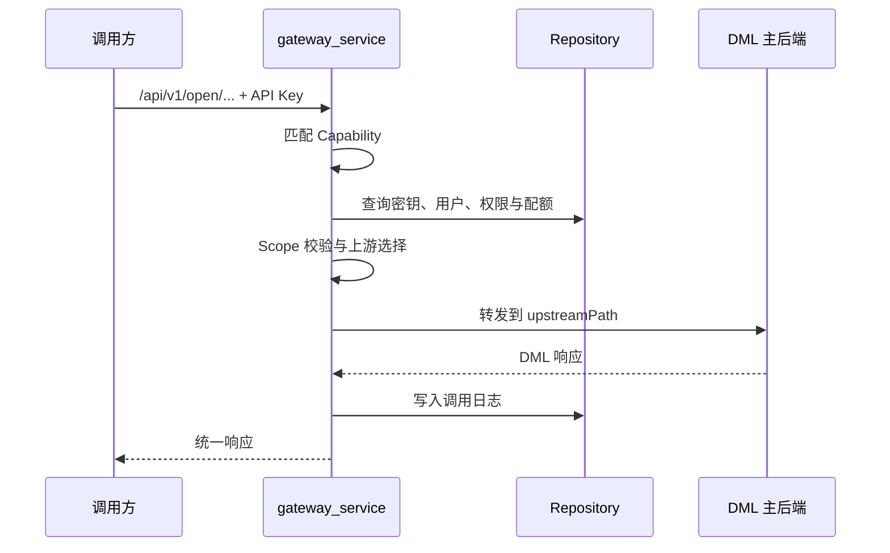
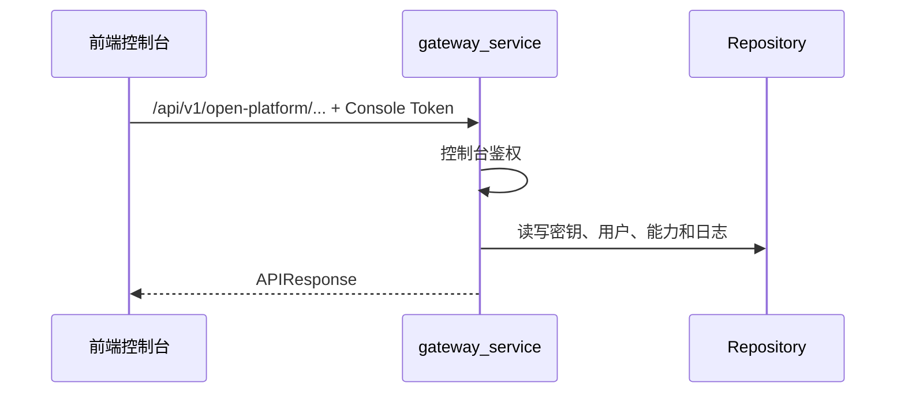

# 总体架构

开放平台位于外部调用方与 DML 主后端之间，提供统一入口与治理能力。

## 核心目标

| 目标 | 说明 |
| --- | --- |
| 稳定开放契约 | 开放 API 路径不必与 DML 主后端内部路径一一对应 |
| 访问治理 | 管理 API Key、Scope、用户权限、配额和环境 |
| 请求保护 | 提供请求过滤、负载均衡、超时和熔断 |
| 可观测性 | 记录调用日志、错误码、诊断信息和请求 ID |
| 开发者体验 | 提供能力目录、在线调试和清晰的前端控制台 |

## 后端分层

`gateway_service` 使用五层结构：

| 层 | 目录 | 职责 |
| --- | --- | --- |
| 领域层 | `domain/` | 枚举、Pydantic 模型、统一异常 |
| API 层 | `api/` | FastAPI 路由、参数校验、薄编排 |
| 核心层 | `core/` | 匹配、鉴权、负载均衡、管线、安全 |
| 基础设施层 | `infrastructure/` | SQLite 仓储、上游 HTTP、种子数据、调试探针 |
| 公共层 | `common/` | DI 容器、日志工具、统一响应 |

## 前端结构

前端是 React + TypeScript + Vite 控制台，页面包括：

- 运行概览
- API 密钥
- 开放能力目录
- API 调试台
- 调用日志
- 用户权限
- 用户配额
- MCP 接入说明页

前端默认请求本地网关 `http://127.0.0.1:8820`，仅显式设置 `VITE_OPEN_PLATFORM_USE_MOCK=true` 时使用 Mock 数据。

## 数据流

开放 API 请求链路：

控制台 API 请求链路：

