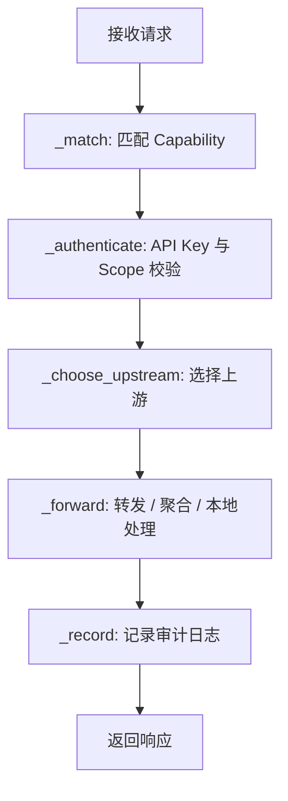

# 网关设计

`gateway_service` 是开放平台的后端核心，基于 FastAPI 实现。它的设计重点是“薄路由 + 请求管线 + 可替换依赖”。

## 请求处理管线

开放 API 由 `api/gateway.py` 接收后交给 `core/pipeline.py`：



## 能力目录

能力目录在 `core/catalog.py` 中维护。每个 `Capability` 是开放 API 的契约单元：

| 字段 | 说明 |
| --- | --- |
| `id` | 能力唯一标识 |
| `name` | 控制台展示名称 |
| `category` | 分类 |
| `method` | HTTP 方法 |
| `path` | 开放 API 路径 |
| `scope` | 调用所需权限 |
| `handler` | `proxy`、`aggregate` 或 `local` |
| `upstreamPath` | 代理到 DML 主后端的路径 |
| `params` | 参数说明 |
| `sampleResponse` | 示例响应 |

## 鉴权模型

开放 API 使用 API Key：

```text
Authorization: Bearer <API Key>
```

控制台 API 使用控制台令牌：

```text
X-Console-Token: <console_token>
X-Console-User-Id: <user_id>
```

或：

```text
Authorization: Bearer <console_token>
```

API Key 校验后还会检查用户权限、密钥 Scope、配额状态和密钥状态。

## 上游认证

网关调用 DML 主后端时会生成内部 JWT，关键配置必须与 DML 主后端一致：

| 配置 | 默认值 |
| --- | --- |
| `DML_GATEWAY_UPSTREAM_AUTH_SECRET` | `dev-open-platform-gateway-secret-change-me` |
| `DML_GATEWAY_UPSTREAM_AUTH_ISSUER` | `dml-open-platform` |
| `DML_GATEWAY_UPSTREAM_AUTH_AUDIENCE` | `dml-backend` |
| `DML_GATEWAY_UPSTREAM_AUTH_TTL_SECONDS` | `300` |

## 错误响应

网关内部抛出 `GatewayError`，路由层通过 `common/responses.py` 统一转换为响应：

```json
{
  "code": 401,
  "message": "Invalid or revoked API key",
  "data": {
    "error": "AUTHENTICATION_FAILED"
  }
}
```

常见状态码：

| 状态码 | 含义 |
| --- | --- |
| 401 | API Key 无效、撤销或控制台 Token 错误 |
| 403 | Scope 或用户权限不足 |
| 404 | 未匹配开放能力 |
| 429 | 超出配额、RPM 或并发限制 |
| 503 | 上游不可用或熔断 |

## 架构约束

- `api/` 只做参数解析和编排，不写业务算法。
- 错误响应统一收敛到 `common/responses.py`。
- 控制台 debug 委托 `infrastructure/debug_probe.py`。
- 种子数据集中在 `infrastructure/seed_data.py`。
- 可替换组件通过 Protocol 或同形接口注入。
